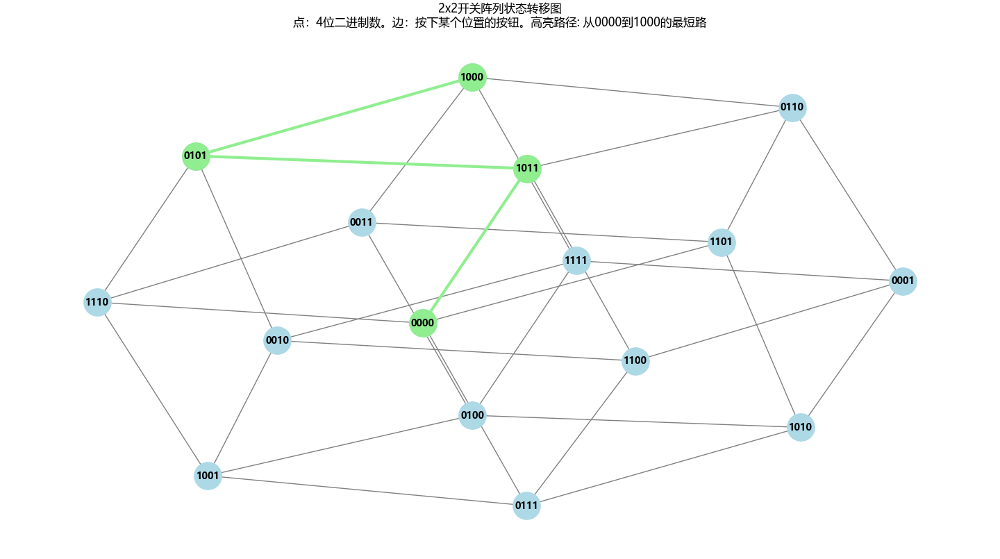

<SlidevPageRedirector />
<MovingWatermark />

留空

---

## 题干

<div class="flex justify-center items-center">

右图为一个开关阵列，每个开关只有“开”和“关”两种状态，按其中一个开关1次，将导致自身和所有相邻的开关改变状态。例如，按 $(2,\ 2)$ 将导致 $(1,2),\ (2,1),\ (2,2),\ (2,3),\ (3,2)$ 改变状态。如果要求只改变 $(1,\ 1)$ 的状态，则需按开关的最少次数为？

| $(0,\ 0)$ | $(0,\ 1)$ | $(0,\ 2)$ |
| --------- | --------- | --------- |
| $(1,\ 0)$ | $(1,\ 1)$ | $(1,\ 2)$ |
| $(2,\ 0)$ | $(2,\ 1)$ | $(2,\ 2)$ |
</div>

$$
\textcolor{orange}{
\boldsymbol{
\begin{cases}
\text{状态压缩、图论最短路问题} \\
\text{Python图可视化方案：networkx、pyvis} \\
\text{布尔环（等价于模2剩余类环）/布尔代数} \\
\text{高斯消元}
\end{cases}
}
}
$$

<div class="h-30 flex justify-center items-center text-[44px] text-orange">
OIER/ACMER会感到十分亲切的经典好题~
</div>

---

## ACMER看这题的独特视角：图论最短路问题

打过**算法竞赛**的同学，应该会觉得这题很是亲切~首先，我们对9个格子的位置进行编码

| 0 $(0,\ 0)$ | 1 $(0,\ 1)$ | 2 $(0,\ 2)$ |
| ----------- | ----------- | ----------- |
| 3 $(1,\ 0)$ | 4 $(1,\ 1)$ | 5 $(1,\ 2)$ |
| 6 $(2,\ 0)$ | 7 $(2,\ 1)$ | 8 $(2,\ 2)$ |

为什么这里的坐标和位置编号都从0开始呢？因为这样方便把坐标转化为位置编号。比如 $(2,\ 1)$ 对应的位置编号是 $2*3+1=7$ ， $(1,\ 2)$ 对应的位置是 $1*3+2=5$ ，这里3是列的数量（注：题干的坐标是从1开始算的，如果没有特殊说明也不涉及题干，我都从0开始编号了）

我们希望把开关阵列的所有可能状态都一一映射到某个数字，所以接下来要引入**状态压缩**：格子有9个，我们就引入一个9位**二进制数**，来表示开关阵列的一个**状态**。约定某个二进制位为1，表示这个位置的开关打开。

---

## ACMER看这题的独特视角：图论最短路问题（续）

举个栗子： $0b101010110$ 的第1、2、4、6、8位为1，表示位置 $(0,0),\ (1,0),\ (1,2),\ (2,1)$ 的开关关闭， $(0,1),\ (0,2),\ (1,1),\ (2,0),\ (2,2)$ 的开关打开。

| 0 $(0,\ 0)$ 关闭 | 1 $(0,\ 1)$ 打开 | 2 $(0,\ 2)$ 打开 |
| -------------- | -------------- | -------------- |
| 3 $(1,\ 0)$ 关闭 | 4 $(1,\ 1)$ 打开 | 5 $(1,\ 2)$ 关闭 |
| 6 $(2,\ 0)$ 打开 | 7 $(2,\ 1)$ 关闭 | 8 $(2,\ 2)$ 打开 |

于是我们知道，开关阵列有 $2^9=512$ 个状态。而对于任何一个状态，选择一个位置按开关，就前往另一个相邻的状态。有9个位置可选，我们就说，当前状态走一步，可以到达9个相邻的状态。比如，对于状态 $0b000000001$ ，在0号位置按一次开关，就前往状态 $0b 000001010$

至此，我们就能正式引入**图论**模型来描述这道题了：记每个状态为**点**，选择一个位置按开关，就在当前状态和邻居状态之间连一条**无向边**。求从起始状态（0）到目标状态（`000010000`）按开关的最少次数，相当于求从起点到终点的最短路。

---
layout: two-cols
---

<style>
.slidev-layout.two-columns {
  gap: 1rem;
}
</style>

## 图论可视化：通义千问网页端

<div class="text-sm">

1. 大佬，有一个2乘2的开关阵列，每个开关只有“开”和“关”两种状态，按其中一个开关1次，将导致自身和所有相邻的开关改变状态。我们引入状态压缩：开关阵列全关记为状态0，全开记为状态0b1111=15，则按位置0状态由0变为0b0111。于是可以建立一个图论模型。请用Python写代码，可视化这题的图
2. 大佬，请在我给你的代码的基础上修改：请帮我高亮显示任意一条从0000到1000的最短路径
3. 大佬，请在我给你的代码的基础上修改：我现在已经引入了`pyvis`，但发现使用`nt.from_nx(G)`后只获得了最基本的点、边信息。请帮我把当前networkx有的逻辑完整迁移到pyvis。你只需要输出需要改动的代码

注：状态0b1000表示右下角为开，其他3个开关关闭
</div>

| 0 $(0,0)$ 关闭 | 1 $(0,1)$ 关闭 |
| ------------ | ------------ |
| 2 $(1,0)$ 开启 | 3 $(1,1)$ 开启 |


::right::

```python {*}{maxHeight:'472px'}
import networkx as nx
import matplotlib.pyplot as plt
from pyvis.network import Network
import os

file_dir = os.path.dirname(__file__)
pyvis_html_path = os.path.join(file_dir, '2x2开关阵列状态转移图.html')

# 按位置0 → 影响 0,1,2 其他同理
press_effect = [
    [0, 1, 2],
    [0, 1, 3],
    [0, 2, 3],
    [1, 2, 3]
]

G = nx.Graph()

for state in range(16):
    G.add_node(state)

for state in range(16):
    for button in range(4):
        new_state = state
        for pos in press_effect[button]:
            new_state ^= (1 << pos)
        G.add_edge(state, new_state, button=button)

source_state = 0
target_state = 8   # 0b1000

shortest_path_nodes = nx.shortest_path(G, source=source_state, target=target_state)
shortest_path_edges = [(shortest_path_nodes[i], shortest_path_nodes[i + 1]) for i in range(len(shortest_path_nodes) - 1)]

plt.figure(figsize=(12, 10))

pos = nx.spring_layout(G, seed=42)
nx.draw_networkx_nodes(G, pos, node_size=800, node_color='lightblue')
nx.draw_networkx_edges(G, pos, edge_color='gray', width=1)

nx.draw_networkx_nodes(G, pos, nodelist=shortest_path_nodes, node_size=800, node_color='lightgreen')
nx.draw_networkx_edges(G, pos, edgelist=shortest_path_edges, edge_color='lightgreen', width=3)

labels = {node: format(node, '04b') for node in G.nodes()}
nx.draw_networkx_labels(G, pos, labels, font_size=10, font_weight='bold')

nt = Network(bgcolor='hsl(231, 15%, 18%)')
for node in G.nodes():
    label = format(node, '04b')
    if node in shortest_path_nodes:
        nt.add_node(node, label=label, color='lightgreen', shape='circle', title=f"状态{label}（在最短路上）")
    else:
        nt.add_node(node, label=label, color='lightblue', shape='circle', title=f"状态{label}")

for u, v, data in G.edges(data=True):
    button = data.get('button', -1)
    if (u, v) in shortest_path_edges or (v, u) in shortest_path_edges:
        nt.add_edge(u, v, color='lightgreen', value=1.5, title=f"按开关{button}")
    else:
        nt.add_edge(u, v, color='white', value=1, title=f"按开关{button}")
nt.show(pyvis_html_path, notebook=False)

plt.rcParams['font.sans-serif'] = ['Microsoft YaHei']
plt.title("2x2开关阵列状态转移图\n"
          "点：4位二进制数。边：按下某个位置的按钮。高亮路径: 从0000到1000的最短路")
plt.axis('off')
plt.tight_layout()
plt.show()
```

---
layout: two-cols-header
---

## 图论可视化结果

::left::

1. 我的代码提供了`networkx`版本和`pyvis`版本的可视化。前者是一张静止图片，后者是一个可交互的网页。此外，`networkx`的可视化结果是固定的，从图像里看不出**对称性**。`pyvis`的可视化结果是随机的，多刷新几次就能看到具有对称性的图形态
2. 我们看到，从状态0到状态8（仅 $(1,1)$ 打开）的一条最短路径是`0000 -> 1011 -> 0101 -> 1000`，按开关顺序是 $(0,1),\ (1,1),\ (1,0)$ （`1 -> 3 -> 2`）。
3. `pyvis`可视化效果演示视频里还展示了另一条最短路径`3 -> 1 -> 2`。我们发现，先按1再按3，和先按3再按1，到达的都是状态`0101=5`

::right::

<div class="flex justify-center h-full pt-4">
  
</div>

---

## 探索关键性质

拿到这道题，最需要的是展开想象力，大胆探索题目具有的性质。

<div class="flex justify-center items-center">

设9个位置各被按了 $a_{i},\ 0 \leq i \leq 8$ 次。考虑每一个位置可能被哪些位置影响。

| $a_{0}$ | $a_{1}$ | $a_{2}$ |
| ------- | ------- | ------- |
| $a_{3}$ | $a_{4}$ | $a_{5}$ |
| $a_{6}$ | $a_{7}$ | $a_{8}$ |
</div>

以0号位置为例，它可能被0、1、3号位置影响，于是我们得到 $a_{0}+a_{1}+a_{3}$ 是奇数。同理，1号位置可能被0、1、2、4号位置影响，于是得到 $a_{0}+a_{1}+a_{2}+a_{4}$ 是偶数。以此类推，我们可以列出9个约束条件。我们想要的就是 $\sum_{i=0}^{8} a_{i}$ 的最小值

---

## 性质1：不要在同一位置连续按

首先，我们不难发现性质1：连续按某个位置奇数次，和按某个位置1次的效果完全一样。连续按某个位置偶数次，相当于没按过按钮。

性质1意味着什么呢？我们举些栗子：

1. 依次按位置 $1,1,4,5,1,4$ ，可以简化为 $4,5,1,4$
2. 依次按位置 $4,5,1,1,1,4$ ，可以简化为 $4,5,1,4$

---

## 性质2：按下按钮的顺序

性质2：对于当前的开关阵列S，先按位置x再按y，和先按位置y再按位置x的效果一样

证明：设按位置x会使得开关阵列里的 $X=\{i_{1},\dots i_{m}\}$ 这些位置的状态取反，按位置y会使得开关阵列里的 $Y=\{j_{1},\dots j_{n}\}$ 这些位置的状态取反。那么我们会发现，因为模2加法满足**交换律**，所以无论先按位置x再按y，还是先按位置y再按位置x，最终效果都是： $X-Y$ 和 $Y-X$ 位置的状态取反， $X \cap Y$ 位置的状态取反2次，相当于不变。

性质1意味着什么呢？举个栗子：依次按位置 $1,1,4,5,1,4$ ，可以重新**排序**为 $1,1,1,4,4,5$

---

## 性质1和性质2一起用：消消乐

性质1和性质2相结合，我们就看到了类似**消消乐**的效果。举个栗子：依次按位置 $1,1,4,5,1,4$ ，可以重新**排序**为 $1,1,1,4,4,5$ ，而连续按一个位置多次，都等价于按一个位置0或1次，所以又可以简化为 $1,4,5$ 。

于是我们只需要记录每个位置是否被按下，就能表示一切操作序列了。换句话说，每个操作序列都可以映射到一个9位**二进制数**。还是刚刚的栗子，依次按位置 $1,1,4,5,1,4$ ，相当于依次按 $1,4,5$ ，映射到二进制数`000110010`。

---

## 模2剩余类环（布尔环）意义下的线性方程组

这时再回顾假设：9个位置各被按了 $a_{i},\ 0 \leq i \leq 8$ 次，其中 $a_{i}=0,1$ 。现在是时候引入**布尔代数**了！

我们记**模2剩余类环**（或者**布尔环**）是这样的代数结构：只有0和1两个元素。且 $0+0=1+1=0,\ 0+1=1+0=1,\ -0=0,\ -1=1$

我们发现前面列出的9个约束条件，可以变为9个模2意义下的线性方程组

$$
\begin{cases}
a_{0}+a_{1}+a_{3}=1 \\
a_{0}+a_{1}+a_{2}+a_{4}=0 \\
a_{1}+a_{2}+a_{5}=0 \\
a_0 + a_3 + a_4 + a_6 = 0 \\
a_1 + a_3 + a_4 + a_5 + a_7 = 0 \\
a_2 + a_4 + a_5 + a_8 = 0 \\
a_3 + a_6 + a_7 = 0 \\
a_4 + a_6 + a_7 + a_8 = 0 \\
a_5 + a_7 + a_8 = 0
\end{cases}
$$

---

## 在考场上如何解这个模2意义下的线性方程组

$$
\begin{cases}
a_{0}+a_{1}+a_{3}=1 \quad a_{0}+a_{1}+a_{2}+a_{4}=0 \quad a_{1}+a_{2}+a_{5}=0 \\
a_0 + a_3 + a_4 + a_6 = 0 \quad a_1 + a_3 + a_4 + a_5 + a_7 = 0 \\
a_2 + a_4 + a_5 + a_8 = 0 \quad a_3 + a_6 + a_7 = 0 \\
a_4 + a_6 + a_7 + a_8 = 0 \quad a_5 + a_7 + a_8 = 0
\end{cases}
$$

回忆刚刚引入的**布尔环**： 只有0和1两个元素。且 $0+0=1+1=0,\ 0+1=1+0=1,\ -0=0,\ -1=1$ 。不妨用做小学逻辑题的技巧来推理出每个变量的值！

从上到下记这些方程为方程(1)到(9)。$(2)-(3):\ a_{0}+a_{4}=a_{5}$ ，$(8)-(9):\ a_{4}+a_{6}=a_{5}$ ，两式左右相减得 $a_{0}=a_{6}$ 。那就代入a0、a6都出现的方程4： $a_{3}+a_{4}=0 \implies a_{3}=a_{4}$ 。那就代入a3、a4都出现的方程5： $a_{1}+a_{5}+a_{7}=0$ （记为方程10）。 $(10)-(3):\ a_{2}=a_{7}$ ，似乎卡住了，没关系。

$(7)-(8):\ a_{3}=a_{4}+a_{8}$ ，结合刚刚的 $a_{3}=a_{4}$ 得 $a_{8}=0$ 。代入方程9得 $a_{5}+a_{7}=0 \implies a_{2}=a_{5}=a_{7}$ ，记为等式11。等式11代入方程3： $a_{1}=0$ 。等式11代入方程6： $a_{4}+a_{8}=0 \implies a_{4}=0 \implies a_{3}=a_{4}=0=a_{1}=a_{8}$ ，记为等式12。等式12代入方程1得 $a_{0}=1=a_{6}$ ， $a_{0}=1$ 代入方程2得 $a_{2}=1=a_{7}=a_{5}$ 。至此每个变量都解出来了，位置1、3、4、8为0，其他5个为1

---

## 本题答案

答案唯一，如下表所示：

| 1   | 0   | 1   |
| --- | --- | --- |
| 0   | 0   | 1   |
| 1   | 1   | 0   |

所以最少按5次，其中一个最优操作序列是依次按下位置 $0,\ 3,\ 5,\ 6,\ 7$

---
layout: two-cols
---

<style>
.slidev-layout.two-columns {
  gap: 1rem;
}
</style>

## 如何写代码求解这个模2意义下的线性方程组

给通义千问网页端的提示词：

1. 大佬，请帮我用Python写出解这9个在模2意义下的线性方程组的代码
2. 大佬，请帮我用Python写出解这9个在模2意义下的线性方程组的代码。请使用高斯消元法，并且优先考虑使用numpy之类的包来实现，实在做不到，再考虑手打高斯消元法

运行结果：`['(1,1)', '(1,3)', '(2,3)', '(3,1)', '(3,2)']`（用的是题干的坐标编号）

::right::

```python {*}{maxHeight:'472px'}
import itertools
import numpy as np


def brute_force():
    equations = [
        ([1, 1, 0, 1, 0, 0, 0, 0, 0], 1),  # a0 + a1 + a3 = 1
        ([1, 1, 1, 0, 1, 0, 0, 0, 0], 0),  # a0 + a1 + a2 + a4 = 0
        ([0, 1, 1, 0, 0, 1, 0, 0, 0], 0),  # a1 + a2 + a5 = 0
        ([1, 0, 0, 1, 1, 0, 1, 0, 0], 0),  # a0 + a3 + a4 + a6 = 0
        ([0, 1, 0, 1, 1, 1, 0, 1, 0], 0),  # a1 + a3 + a4 + a5 + a7 = 0
        ([0, 0, 1, 0, 1, 1, 0, 0, 1], 0),  # a2 + a4 + a5 + a8 = 0
        ([0, 0, 0, 1, 0, 0, 1, 1, 0], 0),  # a3 + a6 + a7 = 0
        ([0, 0, 0, 0, 1, 0, 1, 1, 1], 0),  # a4 + a6 + a7 + a8 = 0
        ([0, 0, 0, 0, 0, 1, 0, 1, 1], 0),  # a5 + a7 + a8 = 0
    ]

    def check_solution(sol):
        """检查解是否满足所有方程"""
        for coeffs, rhs in equations:
            lhs = sum(c * s for c, s in zip(coeffs, sol)) % 2
            if lhs != rhs:
                return False
        return True

    solutions = []
    for bits in itertools.product([0, 1], repeat=9):
        if check_solution(bits):
            solutions.append(bits)

    print(f"法1：找到 {len(solutions)} 个解：")
    for i, sol in enumerate(solutions):
        weight = sum(sol)
        print(f"解 {i+1}: {sol}, 按下次数: {weight}")

    if solutions:
        min_weight = min(sum(sol) for sol in solutions)
        min_solutions = [sol for sol in solutions if sum(sol) == min_weight]
        print(f"\n最少按下次数: {min_weight}")
        print(f"对应的解 ({len(min_solutions)} 个):")
        for sol in min_solutions:
            positions = []
            for idx, val in enumerate(sol):
                if val == 1:
                    row = idx // 3 + 1
                    col = idx % 3 + 1
                    positions.append(f"({row},{col})")
            print(f"  {positions}")


def gauss():
    A = np.array([
        [1, 1, 0, 1, 0, 0, 0, 0, 0],
        [1, 1, 1, 0, 1, 0, 0, 0, 0],
        [0, 1, 1, 0, 0, 1, 0, 0, 0],
        [1, 0, 0, 1, 1, 0, 1, 0, 0],
        [0, 1, 0, 1, 1, 1, 0, 1, 0],
        [0, 0, 1, 0, 1, 1, 0, 0, 1],
        [0, 0, 0, 1, 0, 0, 1, 1, 0],
        [0, 0, 0, 0, 1, 0, 1, 1, 1],
        [0, 0, 0, 0, 0, 1, 0, 1, 1]
    ], dtype=int)
    b = np.array([1, 0, 0, 0, 0, 0, 0, 0, 0], dtype=int)
    Ab = np.concatenate((A, b.reshape(-1, 1)), axis=1) % 2

    def gauss_elim_gf2(Ab):
        """
        在 GF(2) 上对增广矩阵 Ab 进行高斯-若尔当消元。
        """
        m, n = Ab.shape
        n_vars = n - 1
        row = 0
        col = 0
        pivot_cols = []

        while row < m and col < n_vars:
            pivot_row = None
            for r in range(row, m):
                if Ab[r, col] == 1:
                    pivot_row = r
                    break

            if pivot_row is None:
                col += 1
                continue

            if pivot_row != row:
                Ab[[row, pivot_row]] = Ab[[pivot_row, row]]

            pivot_cols.append(col)

            for r in range(m):
                if r != row and Ab[r, col] == 1:
                    Ab[r] = (Ab[r] + Ab[row]) % 2

            row += 1
            col += 1

        for r in range(row, m):
            if Ab[r, :-1].sum() % 2 == 0 and Ab[r, -1] == 1:
                raise ValueError("方程组无解")

        return Ab, pivot_cols

    reduced_Ab, pivot_cols = gauss_elim_gf2(Ab.copy())

    print("法2：行简化阶梯形增广矩阵:")
    print(reduced_Ab)
    print("\n主元列:", pivot_cols)

    n_vars = 9
    x_particular = np.zeros(n_vars, dtype=int)
    for i, col in enumerate(pivot_cols):
        x_particular[col] = reduced_Ab[i, -1]

    print("\n一个特解 x_p:")
    for i, val in enumerate(x_particular):
        print(f"a{i} = {val}")

    weight = np.sum(x_particular)
    print(f"\n该特解的权重（按下的次数）: {weight}")

    free_cols = [c for c in range(n_vars) if c not in pivot_cols]
    print(f"\n自由变量列: {free_cols}")

    if free_cols:
        min_weight = np.inf
        best_solution = None
        num_free = len(free_cols)
        for combo in range(2**num_free):
            free_vals = [(combo >> i) & 1 for i in range(num_free)]

            x = x_particular.copy()
            for idx, col in enumerate(free_cols):
                x[col] = free_vals[idx]

            current_weight = np.sum(x)
            if current_weight < min_weight:
                min_weight = current_weight
                best_solution = x.copy()

        print(f"\n最小权重解:")
        for i, val in enumerate(best_solution):
            print(f"a{i} = {val}")
        print(f"最小按下的次数: {min_weight}")
    else:
        print(f"\n解唯一，最小按下的次数为: {weight}")


if __name__ == "__main__":
    brute_force()
    print('-' * 30)
    gauss()
```

---
layout: center
class: text-center
---

# 后记

<span class="text-orange font-bold">为做题人的精神自留地添砖加瓦</span>

<span class="text-pink font-bold border border-pink px-2 py-1 rounded-lg">喜欢本期视频的话，别忘了一键三连喔</span>

谢谢观看~
