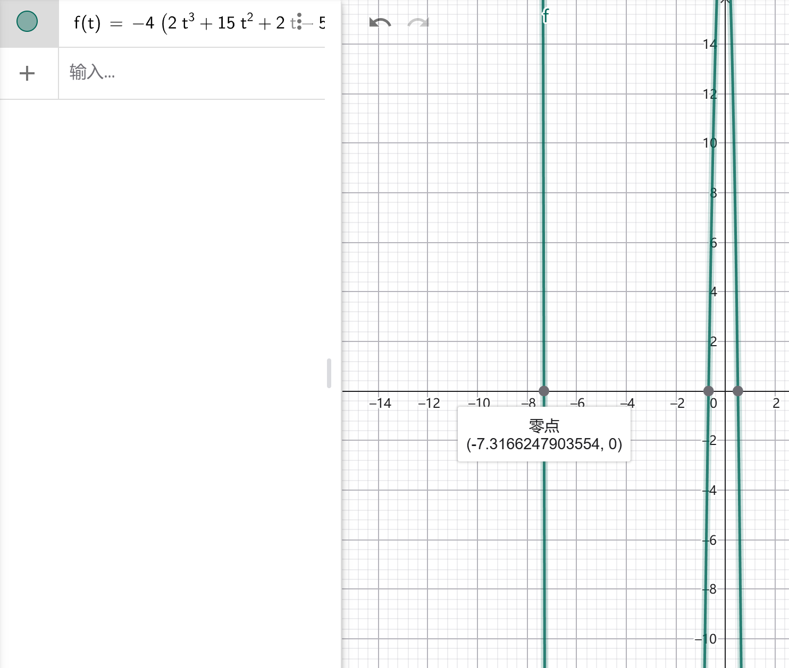

<SlidevPageRedirector />
<MovingWatermark />
<AutoSlide :timeList="[0, 55, 62, 32, 71, 35, 43, 95, 54, 38, 86, 43, 10, 8]" />

留空

---

<div class="flex gap-4 h-[80%]">
  <div style="flex:2;">
    
  </div>

  <div class="flex flex-col justify-center flex-1 text-2xl">

1. 为什么 $(x+1)(5y+2)$ 可以求， $(x+1)(y+2)$ 就求不出？
2. 拉格朗日乘数法简介
3. Gröbner基极粗略介绍（高中生也能看）
4. 用`SageMath`**轻松**求钓鱼题的解析解
  </div>
</div>

<div class="h-30 flex justify-center items-center text-4xl text-orange">
用<span class="text-6xl">CTF Crypto</span>技能包破解高中<span class="text-6xl">钓鱼题</span>！
</div>

---

## 为什么 $(x+1)(5y+2)$ 可以求， $(x+1)(y+2)$ 就求不出？

**三角换元+万能公式**：设 $x=\frac{1-t^2}{1+t^2},\ y=\frac{2t}{1+t^2}$ ，则 $(x+1)(5y+2) = (\frac{1 - t^2}{1 + t^2} + 1)(5 \cdot \frac{2t}{1 + t^2} + 2) = \frac{2}{1 + t^2} \cdot \frac{2t^2 + 10t + 2}{1 + t^2} = \frac{2(2t^2 + 10t + 2)}{(1 + t^2)^2} = \frac{4t^2 + 20t + 4}{(1 + t^2)^2}$

对这个分式函数求导（仅展示分子）：

$$
(8t + 20)(1 + t^2)^2 - (4t^2 + 20t + 4) \cdot 4t(1 + t^2)=(1+t^2)(2t^3 + 15t^2 + 2t - 5)(-4)
$$

令 $2t^3 + 15t^2 + 2t - 5=0$ ，发现可以试根得到其中一个根 $t=\frac{1}{2}$ ，于是可以进行多项式除法 $\frac{2t^3 + 15t^2 + 2t - 5}{2t-1}=t^2 + 8t + 5$ ，于是得到另外两个极值点 $t = -4 \pm \sqrt{11}$

<div class="flex gap-4">
<div class="flex-[2]">

我们看导数的分子的图像，不难想象原分式函数的图像。发现只需要对比 $t=-4-\sqrt{ 11 }$ 和 $t=\frac{1}{2}$ 处函数值的大小。对比发现 $t=\frac{1}{2}$ 时函数取得最大值 $\frac{48}{5}$ ，此时 $x=\frac{3}{5},\ y=\frac{4}{5}$
</div>

<div class="flex-1 h-50">
  
</div>
</div>

---

## 为什么 $(x+1)(5y+2)$ 可以求， $(x+1)(y+2)$ 就求不出？（续）

同样对 $(x+1)(y+2)$ 用三角换元+万能公式： $(x+1)(y+2)=(\frac{1 - t^2}{1 + t^2} + 1)(\frac{2t}{1 + t^2} + 2)=\frac{4t^2 + 4t + 4}{(1 + t^2)^2}$

对这个分式函数求导（仅展示分子）：

$$
(8t + 4)(1 + t^2)^2 - (4t^2 + 4t + 4) \cdot 4t(1 + t^2)=(1 + t^2) \cdot (-4)(2t^3 + 3t^2 + 2t - 1)
$$

这个函数在R上只有一个根，而且它不能试出来。

<div class="h-30 flex justify-center items-center text-4xl text-orange">
无论用什么方法，都必须求解<span class="text-6xl">一元三次方程</span>
</div>

---

## 拉格朗日乘数法简介

> 已知 $x^2+y^2=1$ ，求 $(x+1)(y+2)$ 最大值

这类问题在微积分里属于**条件极值问题**，其中 $x^2+y^2=1\ (\phi(x,y)=x^2+y^2-1=0)$ 叫**约束条件**（**约束方程**）， $f(x,y)=(x+1)(y+2)$ 叫**目标函数**。

我们以两个变量x、y、两个约束条件 $\phi_{1}(x,y)=0,\ \phi_{2}(x,y)=0$ ，目标函数 $f(x,y)$ 为例。为了解决这类问题，我们构造拉格朗日函数 $F(x,y,\lambda_{1},\lambda_{2})=f(x,y)+\lambda_{1}\phi_{1}(x,y)+\lambda_{2}\phi_{2}(x,y)$ 。令它对每一个变量的偏导都等于0：

$$
\begin{cases}
\frac{\partial F}{\partial x}=0 \\
\frac{\partial F}{\partial y}=0 \\
\frac{\partial F}{\partial \lambda_{1}}=\phi_{1}(x,y)=0 \\
\frac{\partial F}{\partial \lambda_{2}}=\phi_{2}(x,y)=0
\end{cases}
$$

这样解出的x、y一般都包含所有的**极值点**，但也可能包含一些**驻点**。对于某些特殊的函数和约束，拉格朗日乘数法可能会漏掉极值点。

---

## 拉格朗日乘数法-实操

构造拉格朗日函数 $F(x,y,\lambda)=(x+1)(y+2)+\lambda(x^2+y^2-1)$ ，令它对每一个变量的偏导都等于0：

$$
\begin{cases}
2\lambda x + y + 2 = 0 \\
2\lambda y + x + 1 = 0 \\
x^2 + y^2 = 1
\end{cases}
$$

写代码求这个方程组的数值解很简单。但为了求解析解，我们需要先完成消元。实际上，前面讲的三角换元+万能公式就是其中一种手算消元方法。

`SageMath`可以轻松求这个方程组的数值解：

```python
x, y, t = var('x y t')
sols = solve([2 * t * x + y + 2, 2 * t * y + x + 1, x ^ 2 + y ^ 2 - 1])
print(sols) # 我们想要的： [y == 0.576378809869376, x == 0.8171826341820846, t == -1.576378721327477] ，排除一个y=0，以及两个复数根
```

---

## Gröbner基极粗略介绍（高中生也能看）

$$
\begin{cases}
2\lambda x + y + 2 = 0 \\
2\lambda y + x + 1 = 0 \\
x^2 + y^2 = 1
\end{cases}
$$

特征：每一项都只含有 $kx^ay^b, a \geq 0,\ b \geq 0$ ——**多元多项式**方程组（=**单项式**求和）

对于线性方程组，比如

$$
\begin{cases}
2x + 3y = 5 \\
x - y = 1
\end{cases}
$$

用**高斯消元法**把它变成“上三角”形式：

$$
\begin{cases}
x - y = 1 \\
\quad\quad 5y = 3
\end{cases}
$$

这里第二条式子已经消去了x，是单变量方程。我们希望多元多项式方程组也能完成消元——Gröbner基就能做这件事。

---

## 类比Gröbner基和线性空间的基

我们在高中学过**平面向量**和**空间向量**。在平面里，我们通常用 $(1,0),\ (0,1)$ 这两个向量表示平面内所有向量，我们说这两个向量是2维**线性空间**的一组**基**，也可以说这组基生成了2维线性空间。为什么用单位向量呢？其他向量不行吗？实际上，任意两个不共线的向量都可以表示平面内所有向量，比如 $(11,45),\ (14,11)$ 不共线，也可以是一组基。但它的性质没有单位向量“好”，用起来不方便！

给定一组向量 $v_{1},v_{2},\dots,v_{k}$ ，里面可能有一些向量是能够用其他向量**线性表出**的，把这些多余的向量去掉，剩下的向量两两**线性无关**，我们就说它们是一组基。比如，给定 $(11,45),\ (14,11),\ (25,56)$ ，我们发现 $v_{3}=v_{1}+v_{2}$ ，所以 $v_{3}$ 是多余的，去掉它。总之，一组向量总能生成一个**线性空间**，维数不大于向量个数

现在，给定一组多项式 $f_1, f_2, \dots, f_k$，它们生成一个**理想（ideal）** $I = \langle f_1, \dots, f_k \rangle$ ，你可以非常粗略地类比成线性空间。我们希望在这组多项式生成的理想中找到一些性质“好”的基，完成**消元**。

如果我们能在Gröbner基中找到一元多项式，那就成功完成了消元。如果这个多项式的性质比较好（比如，次数小于等于4），那就能得到方程组的解析解。

---

## 看懂求Gröbner基的代码的必要概念补充

- **单项式**：常数和一些变量的乘积，比如 $4x^2y^3$ 。单项式求和就是多项式
- **环**：在集合R中定义两种运算：加法和乘法，满足下面的性质，就说 $(R,+,*)$ 构成环：1. $(R,+)$ 是交换群（加法封闭、结合律、单位元存在、每个元素有逆元、交换律）2. $(R,*)$ 是半群（乘法封闭、结合律、单位元存在）3. 乘法对加法满足左右两边的分配律： $(a+b)*c=a*c+b*c,\ c*(a+b)=c*a+c*b$
- **多项式环**：有环R， $R[x]=\{f(x)=\sum_{k=0}^{n} a_{k}x^k|a_{k} \in R\}$ 是R上多项式集，称 $(R[x],+,*)$ 为多项式环。把 $R[x]$ 再次代入可以定义多元多项式环 $R[x,y]=R[x][y],\ R[x,y,z]=R[x,y][z],\ \cdots$ 。简单理解： $R[x][y]$ 表示以y为主元，系数是关于x的多项式（分别从**主元视角**和**单项式视角**理解多元多项式）
- **字典序**：为了实现消元求出Gröbner基的过程，需要规定单项式之间的顺序关系，它会影响消元顺序。规定方式不唯一，我们仅介绍字典序。千言万语不如一个例子：设单项式 **$kx^ay^bz^c$** ，且 $x>y>z$ ，则可以写出4元组 $(a,b,c,k)$ 。对于两个4元组，优先比较a的大小，a大则4元组大，a一样则比较b，b也一样则比较c，以此类推。

```python
''' 3*t^2*x^2  ->  (2, 2, 0)    2*t^2*x^2  ->  (2, 2, 0)    t^2*x^2  ->  (2, 2, 0)
    t^2*x*y^3  ->  (2, 1, 3)    t^2*x*y^2  ->  (2, 1, 2)    t*x^5*y^10  ->  (1, 5, 10)
    t*x^4*y^11  ->  (1, 4, 11)    x^3*y  ->  (0, 3, 1)    x^2*y^99  ->  (0, 2, 99)
    x^2*y^2  ->  (0, 2, 2)    114514*y^100  ->  (0, 0, 100)    y^100  ->  (0, 0, 100)
    1919810  ->  (0, 0, 0)'''
```

---

## SageMath简介

SageMath：开源Python数学软件，在Python语法基础上增加了些语法糖

在线运行sage代码： https://sagecell.sagemath.org/

求数值解：

```python
x, y, t = var('x y t')
sols = solve([2 * t * x + y + 2, 2 * t * y + x + 1, x ^ 2 + y ^ 2 - 1])
print(sols) # 我们想要的： [y == 0.576378809869376, x == 0.8171826341820846, t == -1.576378721327477] ，排除一个y=0，以及两个复数根
```

运行环境：Windows10 WSL2 Ubuntu-24.04

运行命令：按[官方文档](https://doc.sagemath.org/html/en/installation/index.html)提示，运行`conda activate sage`后，就能使用命令`sage '1-(x+1)(y+2)-prob/solve_directly.sage'`来运行sage代码了。

1. 文件扩展名必须是`.sage`。sage在Python的基础上添加了些语法糖
2. 命令执行后，会生成一个`.py`文件，比如上面的命令会生成`1-(x+1)(y+2)-prob/solve_directly.sage.py`

---

### 写sage代码破解钓鱼题！

<div class="flex gap-4">

```python
R.<t, x, y> = PolynomialRing(QQ, order='lex')
f = (x + 1) * (y + 2) + t * (x ^ 2 + y ^ 2 - 1)
fdx = diff(f, x)
fdy = diff(f, y)
fdt = diff(f, t)
print(fdx, fdy, fdt)
I = ideal(fdx, fdy, fdt).groebner_basis()
print(I)
```

→

```python
'''
偏导： 2*t*x + y + 2    2*t*y + x + 1    x^2 + y^2 - 1
（和《拉格朗日乘数法-实操》展示的结果一样）。Gröbner基：
[t + 2*y^3 + 4*y^2 + 3/2*y - 1,
 x - 2*y^2 - 2*y + 1,
 y^4 + 2*y^3 + 1/4*y^2 - y]
'''
```
</div>

1. 定义三元多项式环 R，变量是`t, x, y`，系数在QQ（有理数域）中。`order='lex'`表示序关系规则采用**字典序**（lexicographic order，前面介绍的），且 $t>x>y$
2. 定义**拉格朗日函数**，然后调用`diff()`求**偏导**
3. `ideal()`构造由这三个偏导组成的多项式**理想**，`.groebner_basis()`计算该理想的Gröbner基

<div class="flex gap-4">

```python
y_func_factor = I[2].factor()
print(y_func_factor)  # y_func_factor 只是运行来看看结果

y = var('y')
sols = solve(y ^ 3 + 2 * y ^ 2 + 1 / 4 * y - 1)
print(sols)
```

→

```python
# (1/4) * y * (4*y^3 + 8*y^2 + y - 4)
# 方程有3个根，太长了这里放不下。前两个是复数，第三个是我们想要的
# 像下面这么写，求单变量多项式的根，也是OK的
y_func_sym = y ^ 3 + 2 * y ^ 2 + 1 / 4 * y - 1
sols = y_func_sym.roots()
wanted_y = sols[2][0]
```
</div>

1. `factor()`对多项式进行因式分解，我们需要查看结果来确定要解的**次数更低**的一元多项式方程

---

### 写sage代码破解钓鱼题！（续）

<div class="flex gap-4">

```python
wanted_y = sols[2].rhs()
wanted_y_n = wanted_y.n()
x = 2 * y ^ 2 + 2 * y - 1
wanted_x_n = x.subs(y=wanted_y).n()
goal = (x + 1) * (y + 2)
ans = goal.subs(y=wanted_y)
ans_simplified = ans.simplify_full()
n_ans = ans.n()

latex(wanted_y)
```

<div>

1. sage的`solve()`返回的解的类型是`sage.symbolic.expression.Expression`。只有**二元关系**才能调用`.lhs(), .rhs()`。对于二元关系`y == 1/6`，调用`.lhs()`得`'y'`，调用`.rhs()`得`1/6`
2. 变量`x`的表达式也是从上一页展示的Gröbner基拿到的
3. 调用`.n()`可以把解析解转为数值解
4. 调用`.subs()`可以对表达式求值
5. 调用`.simplify_full()`尝试化简表达式
6. `latex(wanted_y)`拿到一个表达式的latex字符串，比如 $\sqrt{3}$ (`\sqrt{3}`)
</div>
</div>

吐槽`latex()`踩坑：输出的字符串有可能在Obsidian合法，但在slidev中不合法。bug原因可能是括号没有完全匹配。我暂时没想到好的解决办法，只好直接问LLM帮我输出相关公式

---

## 答案——是的，答案需要占用一整页来展示

$$
y = \frac{1}{6} \, {\left(3 \, \sqrt{183} + 62\right)}^{\frac{1}{3}} + \frac{13}{6 \, {\left(3 \, \sqrt{183} + 62\right)}^{\frac{1}{3}}} - \frac{2}{3}
$$

数值解：`x = 0.8171826, y = 0.576379, ans = 4.681751`。答案的解析解：

$$
\begin{aligned}
\frac{1}{108} &\left( \left( \left(3 \sqrt{183} + 62\right)^{\frac{1}{3}} + \frac{13}{\left(3 \sqrt{183} + 62\right)^{\frac{1}{3}}} - 4 \right)^{2} + 6 \left(3 \sqrt{183} + 62\right)^{\frac{1}{3}} + \frac{78}{\left(3 \sqrt{183} + 62\right)^{\frac{1}{3}}} - 24 \right) \\
&\left( \left(3 \sqrt{183} + 62\right)^{\frac{1}{3}} + \frac{13}{\left(3 \sqrt{183} + 62\right)^{\frac{1}{3}}} + 8 \right)
\end{aligned}
$$

调用`simplify_full()`化简后的答案：

$$
\frac{ \left(5 \sqrt{183} + 216\right) \left(3 \sqrt{183} + 62\right)^{\frac{2}{3}} + 24 \left(3 \sqrt{183} + 62\right)^{\frac{4}{3}} + 313 \sqrt{183} + 5004 }{ 12 \left(3 \sqrt{183} + 62\right)^{\frac{4}{3}} }
$$

---
layout: two-cols-header
---

## 附录

::left::

完整代码：

```python {*}{maxHeight:'448px'}
R.<t, x, y> = PolynomialRing(QQ, order='lex')
f = (x + 1) * (y + 2) + t * (x ^ 2 + y ^ 2 - 1)
fdx = diff(f, x)
fdy = diff(f, y)
fdt = diff(f, t)
print(fdx, fdy, fdt)
I = ideal(fdx, fdy, fdt).groebner_basis()
print(I)

y_func_factor = I[2].factor()
print(y_func_factor)

y = var('y')
sols = solve(y ^ 3 + 2 * y ^ 2 + 1 / 4 * y - 1)
print(sols)

wanted_y = sols[2].rhs()
wanted_y_n = wanted_y.n()
x = 2 * y ^ 2 + 2 * y - 1
wanted_x_n = x.subs(y=wanted_y).n()
goal = (x + 1) * (y + 2)
ans = goal.subs(y=wanted_y)
ans_simplified = ans.simplify_full()
n_ans = ans.n()
```

::right::

探究字典序的排序规则：

```python {*}{maxHeight:'448px'}
R.<t, x, y> = PolynomialRing(QQ, order='lex')

mon_order = R.term_order()
print('单项式序类型：', mon_order)
print('变量优先级（从高到低）：', R.variable_names(), '\n')

m1 = t ^ 2 * x * y ^ 3
m2 = t ^ 2 * x ^ 2
m3 = t * x ^ 5 * y ^ 10
m4 = x ^ 3 * y
m5 = y ^ 100
m6 = t ^ 2 * x * y ^ 2  # 与 m1 比，仅 y 指数不同
m7 = 3 * t ^ 2 * x ^ 2  # 与 m2 比，仅系数不同
m8 = x ^ 2 * y ^ 99
m9 = t * x ^ 4 * y ^ 11
m10 = x ^ 2 * y ^ 2
m11 = 1919810 * y ^ 0
m12 = 114514 * y ^ 100
m13 = 2 * t ^ 2 * x ^ 2

monomials = [
    m1, m2, m3, m4, m5, m6, m7,
    m8, m9, m10, m11, m12, m13
]

print('单项式及其指数元组 (t, x, y)：')
for m in monomials:
    exp_tuple = m.exponents()[0]
    print(f'{m}  ->  {exp_tuple}')

print('\n按 lex 顺序从大到小排序：')
sorted_mons = sorted(monomials, reverse=True)
for m in sorted_mons:
    exp_tuple = m.exponents()[0]
    print(f'{m}  ->  {exp_tuple}')
'''
3*t^2*x^2  ->  (2, 2, 0)
2*t^2*x^2  ->  (2, 2, 0)
t^2*x^2  ->  (2, 2, 0)
t^2*x*y^3  ->  (2, 1, 3)
t^2*x*y^2  ->  (2, 1, 2)
t*x^5*y^10  ->  (1, 5, 10)
t*x^4*y^11  ->  (1, 4, 11)
x^3*y  ->  (0, 3, 1)
x^2*y^99  ->  (0, 2, 99)
x^2*y^2  ->  (0, 2, 2)
114514*y^100  ->  (0, 0, 100)
y^100  ->  (0, 0, 100)
1919810  ->  (0, 0, 0)
'''
```

---
layout: center
class: text-center
---

# 后记

<span class="text-orange font-bold">为做题人的精神自留地添砖加瓦</span>

<span class="text-pink font-bold border border-pink px-2 py-1 rounded-lg">喜欢本期视频的话，别忘了一键三连喔</span>

谢谢观看~
