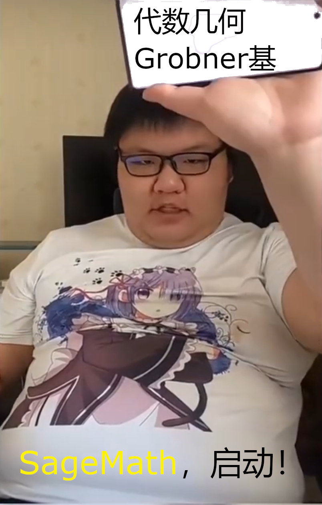
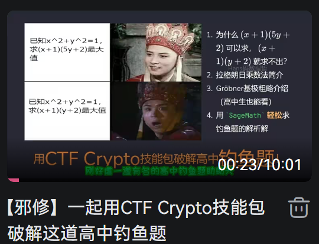

<SlidevPageRedirector />
<MovingWatermark />
<AutoSlide :timeList="[0, 28, 41, 22, 50, 45, 17, 12.5, 24.5, 17.5, 36]" />

留空

---

<div class="flex gap-8">
<div>

## 题干

已知 $a,\ b,\ c$ 是不全相等的实数，且

$$
\begin{cases}
a=ab+c \\
b=bc+a \\
c=ca+b
\end{cases}
$$

求 $a+b+c$

### 要素察觉

回头看旧题，却有新收获：**约束方程**、**目标函数**都是**多元多项式**
</div>


</div>

<div class="h-30 flex justify-center items-center text-8xl text-orange">
Grobner基，启动！
</div>

---

## 主包，我没有数竞背景，不会三元对称式，可以做这题吗？

可以的！

1. **Grobner基**帮我们完成消元
2. 消元结果启发我们发现一种**爆算方法**

<div class="pt-4 flex justify-center">

</div>

---

## 求Grobner基

```python
R.<a, b, c> = PolynomialRing(QQ, order='lex')
eq1 = a - a * b - c
eq2 = b - b * c - a
eq3 = c - c * a - b
G = ideal(eq1, eq2, eq3).groebner_basis()
print(G)  # [a - c^4 + 3*c^3 - c^2 - c, b + c^3 - 2*c^2 - c, c^5 - 3*c^4 + 3*c^2]
c_poly = G[-1].factor()
print(c_poly)  # c^2 * (c^3 - 3*c^2 + 3)
```

我们拿到：

$$
\begin{cases}
a = c^4 - 3c^3 + c^2 + c \\
b = -c^3 + 2c^2 + c \\
c^5 - 3*c^4 + 3*c^2 = c^2 * (c^3 - 3*c^2 + 3) = 0
\end{cases}
$$

轻松把目标函数变成关于c的式子：

```python
a_expr = a - G[0]
b_expr = b - G[1]
wanted = a_expr + b_expr + c
print(wanted)  # c^4 - 4*c^3 + 3*c^2 + 3*c
```

---

## 原题已变为初中常规题

已知 $c^3 - 3c^2 + 3 = 0$ ，求 $c^4 - 4c^3 + 3c^2 + 3c$

这类题的**通解方法**：转为**降幂式** $c^3=3c^2-3$ ，然后按**幂降序**依次消去 $c^4,\ c^3,\ c^2,\ c$ ，最后得到常数

可我不想动笔！幸好，在SageMath里，直接进行多项式取模就能拿到结果：

```python
f = c ^ 3 - 3 * c ^ 2 + 3
quotient = wanted // f
ans = wanted % f
print('商：', quotient, '答案：', ans)
print('验算： (c - 1) * f + 3 确实等于 wanted', (c - 1) * f + 3 == wanted)
```

商： $c-1$ ，答案：3

验证发现： $(c-1)(c ^ 3 - 3c ^ 2 + 3) + 3 = c^4 - 4c^3 + 3c^2 + 3c$ ，所以原题答案确实是3

---

## Grobner基启发我们发现爆算方法

Grobner基告诉我们，直接对这题进行消元是可行的。

$$
a = b - bc = b(1 - c) \tag{4}
$$

$$
b = c - ca = c(1 - a) \tag{5}
$$

把 (4) 代入 (5)：

$$
b = c\big(1 - a\big) = c\big(1 - b(1 - c)\big) = c - b(c - c^2) \implies b = \frac{c}{1 + c - c^2} \tag{6}
$$

若 $D = 1 + c - c^2 = 0$ ，则 **$a = b = c = 0$** ，与题设矛盾，所以可以放心除过去

再把 $a = b(1 - c)$ 代入 (6)： $a = \frac{c(1 - c)}{1 + c - c^2} \quad (7)$

现在a和b都是关于c的函数了，所以 $a+b+c$ 也是关于c的分式函数

但注意：我们还有一条约束方程 $a = ab + c$ 没用到，要用它求出只关于c的**约束**，才能求出 $a+b+c$ 。

---

将 (6)(7) （`a = f(c), b = g(c)`）代入 $a = ab + c$ ：

$$
a = \frac{c(1 - c)}{D} = ab + c = \frac{c^2(1 - c)}{D^2} + c
$$

其中 $D = 1 + c - c^2$ 。两边乘以 $D^2$（前面已经证明 $D \ne 0$），这下就都是关于c的式子了！

$$
c(1 - c) D = c^2(1 - c) + c D^2
$$

这个好难算！写代码算吧：

```python
from sympy import symbols, simplify

c = symbols('c')
D = 1 + c - c ** 2
expr = (1 - c) * (c * D - c ** 2) - c * D ** 2
print(expr)
res = simplify(expr)
print(res)  # c**2*(-c**3 + 3*c**2 - 3)
```

于是我们得到了和Grobner基方法一样的降幂式： $c^3 = 3c^2 - 3$

---

## 已经变为初中常规题

现在我们要求 $a + b + c = \frac{c + c(1-c)}{D} + c$ ，降幂式 $c^3 = 3c^2 - 3,\ D = 1 + c - c^2$

通分：

$$
\frac{c + c(1-c)}{D} + c = \frac{2c-c^2 + cD}{D} = \frac{3c-c^3}{D}
$$

降幂：

$$
\frac{3c-c^3}{D} = \frac{3c - (3c^2 - 3)}{D} = \frac{3 + 3c - 3c^2}{1 + c - c^2} = 3
$$

<div class="pt-4 h-30 flex items-center text-7xl text-orange">
做完！
</div>

---

## Grobner基给的是多项式，爆算法拿到分式函数，不一样啊？

Grobner基：

$$
\begin{cases}
a = c^4 - 3c^3 + c^2 + c \\
b = -c^3 + 2c^2 + c
\end{cases}
$$

爆算：

$$
\begin{cases}
a = \frac{c(1 - c)}{1 + c - c^2} \\
b = \frac{c}{1 + c - c^2}
\end{cases}
$$

实际上，我们有：

$$
\begin{cases}
\frac{c(1 - c)}{1 + c - c^2} \equiv c^4 - 3c^3 + c^2 + c \pmod{c^3 - 3c^2 + 3} \\
\frac{c}{1 + c - c^2} \equiv -c^3 + 2c^2 + c \pmod{c^3 - 3c^2 + 3}
\end{cases}
$$

不需要了解抽象代数，把分母乘过去，进行**多项式除法**就能验证~

---

## 附录：写出本文前的道路曲折

> 大佬，你是一名数学科研工作者，精通代数几何。我有下面的数学竞赛题：a=ab+c，b=bc+a，c=ca+b，且a、b、c是不全相等的实数，求`a+b+c`。我写了如下sage代码：<代码略>。发现Grobner基成功消元：`[a - c^4 + 3*c^3 - c^2 - c, b + c^3 - 2*c^2 - c, c^5 - 3*c^4 + 3*c^2]`。这里最后一个元素可以因式分解`c^2 * (c^3 - 3*c^2 + 3)`。于是我们得到用于降次的式子：`c^3=3c^2-3`。直接把`a+b+c`换成c的式子并降次就能算出结果。请帮我补全这个过程的代码。不要硬编码！

> 大佬，你是一名数学科研工作者，精通代数几何。我有下面的数学竞赛题：a=ab+c，b=bc+a，c=ca+b，且a、b、c是不全相等的实数，求`a+b+c`。我写了如下sage代码：<代码略>。发现Grobner基成功消元：`[a - c^4 + 3*c^3 - c^2 - c, b + c^3 - 2*c^2 - c, c^5 - 3*c^4 + 3*c^2]`。这里最后一个元素可以因式分解`c^2 * (c^3 - 3*c^2 + 3)`。于是我们得到用于降次的式子：`c^3=3c^2-3`，以及`a+b+c=c^4 - 4*c^3 + 3*c^2 + 3*c`。请帮我补全用`c^3=3c^2-3`对`c^4 - 4*c^3 + 3*c^2 + 3*c`进行降次的代码

第一次尝试得到一大堆不知所云的代码，跑不起来。第二次尝试得到下面的用**商环**求解的代码，仍然得不到想要的结果。

```python
S = R.quotient(f, 'cbar')  # 商环 Q[c] / (c^3 - 3c^2 + 3)
cbar = S.gen()  # 商环中的 c
expr_reduced = wanted.subs(c=cbar)  # 将 expr 映射到商环
print("Reduced expression in quotient ring:", expr_reduced.lift())  # lift 回原环
# 输出无意义： a^4 - 4*a^3 + 3*a^2 + 3*a
```

后来发现，只需要进行**多项式取模**就能完成**降幂**过程了

---

## 附录：上一页提到的商环求解代码应该怎么写

提示词：

> 大佬，这个式子 $\frac{c}{1 + c - c^2} \equiv -c^3 + 2c^2 + c \pmod{c^3 - 3c^2 + 3}$ 里的除法是逆元的含义吗？这是抽象代数的内容吗？模 $c^3 - 3c^2 + 3$ 下哪些元素是有逆元的

> 大佬，sage代码里环R上的 $c^4 - 3c^3 + c^2 + c$ 怎么快速转为商环K的cbar的式子

看LLM输出，顺利学会第二种写法：

```python
R.<c> = PolynomialRing(QQ)
f = c ^ 3 - 3 * c ^ 2 + 3
K = R.quotient(f, 'cbar')  # 商环 Q[c] / (c^3 - 3c^2 + 3)
wanted = K(c ^ 4 - 4 * c ^ 3 + 3 * c ^ 2 + 3 * c)  # 映射到商环就自动做好了取模操作
print(wanted)  # 3
```

快速验证 $\frac{c(1 - c)}{1 + c - c^2} \equiv c^4 - 3c^3 + c^2 + c \pmod{c^3 - 3c^2 + 3}$ ：

```python
cbar = K.gen()
denom = 1 + cbar - cbar ^ 2
inv_denom = denom.inverse()
lhs2 = K(c * (1 - c)) * inv_denom
rhs2 = K(c ^ 4 - 3 * c ^ 3 + c ^ 2 + c)
```

---
layout: center
class: text-center
---

# 后记

<span class="text-orange font-bold">为做题人的精神自留地添砖加瓦</span>

<span class="text-pink font-bold border border-pink px-2 py-1 rounded-lg">喜欢本期视频的话，别忘了点赞、收藏、关注喔</span>

谢谢观看~
