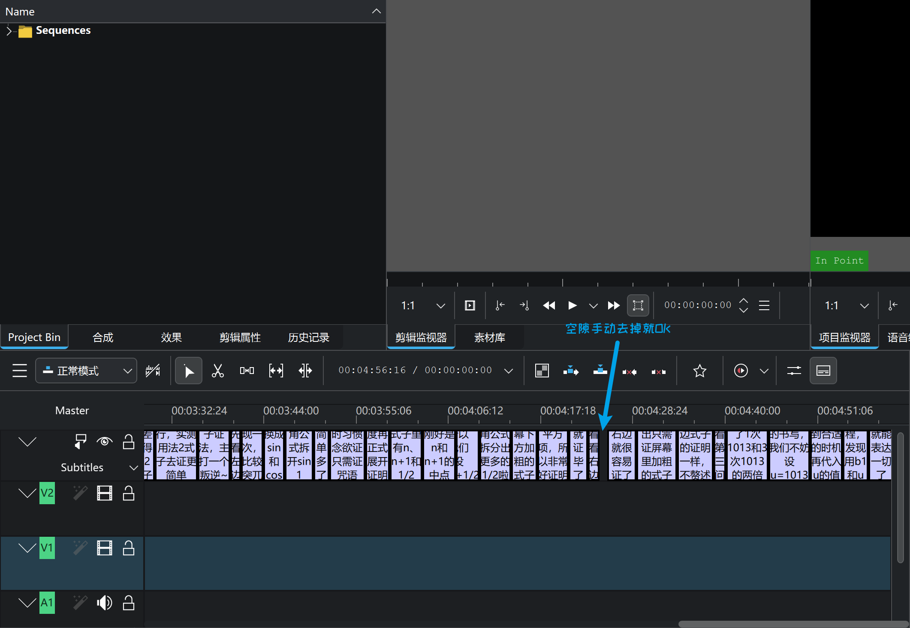

<SlidevPageRedirector />
<MovingWatermark />

## 如何用 edge-tts 为 manim 动画添加旁白

作者： **hans7**

**我们必须想象，做题人是幸福的**

文字稿传送门：见视频简介

---

## pip 安装 edge-tts 踩坑

报错：

```
WARNING: Failed to write executable - trying to use .deleteme logic

ERROR: Could not install packages due to an OSError: [WinError 2] 系统找不到指定的文件。: 'C:\\Python312\\Scripts\\pyside6-assistant.exe' -> 'C:\\Python312\\Scripts\\pyside6-assistant.exe.deleteme'。
```

解决方案：右键“以管理员身份运行”`pwsh.exe/powershell`，再重新执行一样的命令就行。它会被安装到`<python安装路径>\Scripts`文件夹下，这个文件夹已经在`PATH`环境变量中了，所以pip安装完毕后可以直接使用。

---

## edge-tts 的使用

命令示例：

```powershell
edge-tts --voice zh-CN-XiaoxiaoNeural --rate=+20% --file docs\视频文字稿：大题造火箭！长郡二十校26届高三12月联考三角导数压轴.md
  --write-media media\251204\大题造火箭！长郡二十校26届高三12月联考三角导数压轴.mp3
  --write-subtitles media\251204\大题造火箭！长郡二十校26届高三12月联考三角导数压轴.srt
```

个人推荐模型：

- zh-CN-XiaoxiaoNeural
- zh-CN-XiaoshuangNeural
- zh-CN-XiaomengNeural

---

## edge-tts 配合 manim 动画-个人方案

1. 用`edge-tts`生成音频和字幕文件
2. 根据字幕文件的时间轴来确定manim动画的播放时间，重新生成mp4。播放时间要比旁白阅读时间长一些
3. 用剪辑软件来让manim动画和音频、字幕同步。个人使用的开源剪辑软件：`kdenlive`

```python
from manim import *

class TriSinAAdd2sinBEq2sinC(Scene):
    def show_problem_stmt(self):
        title = Text("题干", font_size=60, color=YELLOW)
        title.to_edge(UP, buff=0.5)
        self.play(FadeIn(title, shift=UP))
        # ...
        self.play(Write(stmt))
        self.wait(16)  # “我觉得题源视频”
        # ...
        self.play(ReplacementTransform(stmt, gossip))
        self.wait(20)  # “今天我带来了3种解法”

    def construct(self):
        # ...
        problem_stmt_to_remove = self.show_problem_stmt()
        # ...
        self.show_ending(method3_to_remove)
```

---

## edge-tts 生成的字幕文件有莫名其妙的空隙，怎么办？

<div class="flex justify-center items-center h-full">
  
</div>
