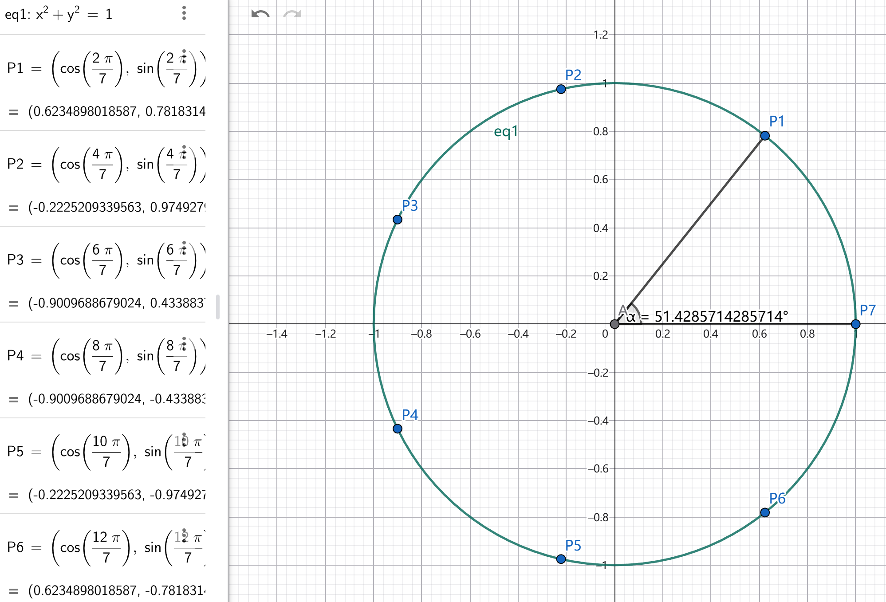

<SlidevPageRedirector />
<MovingWatermark />
<AutoSlide :timeList="[0, 38, 29, 47.5, 31, 24, 34, 35, 32.5, 49, 48.5, 10, 20.5, 12, 11]" />

留空

---

## 题干

单位圆上有7个不同的点，则任意两点间距离平方和的最大值为

<div class="flex gap-5 problem-options">

A. 42

B. 49

C. 56

D. 64

</div>

<div class="text-2xl">

1. n项的**完全平方公式**
2. 欧拉公式求 $\sin a_{1}+\sin(a_{1}+d)+\dots+\sin(a_{1}+(n-1)d),\ \cos a_{1}+\cos(a_{1}+d)+\dots+\cos(a_{1}+(n-1)d)$
3. 彩蛋：用**拉格朗日乘数法+Grobner基**无脑做这题
</div>

<div class="h-30 flex justify-center items-center text-[58px] text-orange">
不难，但审美、训练价值都拉满~
</div>

<style>
.problem-options > p {
  margin: 0;
}
</style>

---

## 逃课技巧

1. 根据对称性，盲猜取到**正n边形**时就是答案
2. 但正n边形情况的值并不好算。那就看看**正三角形**和**正方形**吧
3. 建系时利用**对称性**可减小计算量。算出正三角形的值为9，正方形的值为16
4. 直接盲猜答案 $n^2$ ，跑路~

---

## 法1：直接设点（需要注意力）

设 $P_{i}(x_{i},\ y_{i}),\ i=1 \dots n$ ，则 $ans=\sum_{1 \leq j < i \leq n} |P_{i}P_{j}|^2 = \sum_{1 \leq j < i \leq n} (x_{i}-x_{j})^2+(y_{i}-y_{j})^2$ ，约束方程 $x_{i}^2+y_{i}^2=1$ 。直接把括号打开：

$$
\textcolor{orange}{
\boldsymbol{
ans=\sum_{1 \leq j < i \leq n} (x_{i}^2+y_{i}^2)+(x_{j}^2+y_{j}^2)-2(x_{i}x_{j}+y_{i}y_{j})=n(n-1)-2\sum_{1 \leq j < i \leq n} x_{i}x_{j}+y_{i}y_{j}
}
}
$$

如果你看不懂 $\sum_{1 \leq j < i \leq n}$ 这个记号：它表示2重循环，跑遍所有的 $j < i$ 。比如 $n=2$ 时只取 $j=1,\ i=2$ ， $n=3$ 时取 $i=2,j=1,i=3,j=1,i=3,j=2$ ……

下面这步就需要注意力了，有点初中竞赛的感觉。思想：n项的完全平方公式天然含有每一个 **$x_{i}x_{j},\ j < i$**

我们看最简单的 $n=2$ 情况：由**完全平方公式** $2x_{1}x_{2}+2y_{1}y_{2}=(x_{1}+x_{2})^2-(x_{1}^2+x_{2}^2)+(y_{1}+y_{2})^2-(y_{1}^2+y_{2}^2)=(x_{1}+x_{2})^2+(y_{1}+y_{2})^2-2$

---

## 法1：直接设点（需要注意力）（续）

那我们自然会猜测， $n=3$ 用**3项的完全平方公式**

$$
2\sum_{1 \leq j < i \leq 3} x_{i}x_{j}+y_{i}y_{j} = (x_{1}+x_{2}+x_{3})^2+(y_{1}+y_{2}+y_{3})^2-3
$$

……，一般情况用**n项的完全平方公式**：

$$
\textcolor{orange}{
\boldsymbol{
ans=n(n-1)-((x_{1}+\dots +x_{n})^2+(y_{1}+\dots +y_{n})^2-n)=n^2-((\sum_{i=1}^{n} x_{i})^2+(\sum_{i=1}^{n} y_{i})^2)
}
}
$$

令 $\sum_{i=1}^{n} x_{i}=\sum_{i=1}^{n} y_{i}=0$ 就得到了答案。等等…

<div class="h-30 flex justify-center items-center text-5xl text-orange">
这里的等号真的能取到吗？
</div>

---

## 法2：三角换元（和法1本质一样）

设 $P_{i}(\cos a_{i},\ \sin a_{i}),\ i=1 \dots n$ ，则 $ans=\sum_{1 \leq j < i \leq n} |P_{i}P_{j}|^2 = \sum_{1 \leq j < i \leq n} (\cos a_{i}-\cos a_{j})^2+(\sin a_{i}-\sin a_{j})^2$ 。既然和法1本质一样，那直接跳到法1的最后一步式子吧：

$$
ans=n^2-((\cos a_{1}+\dots +\cos a_{n})^2+(\sin a_{1}+\dots +\sin a_{n})^2)
$$

这里 $\sum_{i=1}^{n} \cos a_{i}=\sum_{i=1}^{n} \sin a_{i}=0$ 真的能取到吗？回顾之前的逃课技巧，我们直接猜测：

<div class="h-30 flex justify-center items-center text-5xl text-orange">
取正n边形就能同时满足这两个等式
</div>

---

## 证明正n边形有 $\sum_{i=1}^{n} \cos a_{i}=\sum_{i=1}^{n} \sin a_{i}=0$

<div class="flex">
<div>

如右图所示，圆的内接正n边形的 $\theta = \frac{2\pi}{n}$ ，所以每个点的夹角分别为 $a_{1},\ a_{1}+\frac{2\pi}{n},\ a_{1}+\frac{4\pi}{n},\ \dots,\ a_{1}+\frac{(2n-2)\pi}{n}$

显然角度**构成等差数列**
</div>


</div>

根据对称性，建系时令其中一点在x轴上（比如 $a_{1}=0$ ）计算会更简单。但我们有NB的结论（[结论的证明传送门](https://www.bilibili.com/video/BV1Z8mFBUE2W)）， $P_{1}$ 的夹角乱跑也没关系：

$$
\textcolor{orange}{
\boldsymbol{
\begin{cases}
\sin a_{1}+\sin(a_{1}+d)+\dots+\sin(a_{1}+(n-1)d)=\frac{\sin \frac{nd}{2}}{\sin \frac{d}{2}}\sin(a_{1}+\frac{n-1}{2}d) \\
\cos a_{1}+\cos(a_{1}+d)+\dots+\cos(a_{1}+(n-1)d)=\frac{\sin \frac{nd}{2}}{\sin \frac{d}{2}}\cos(a_{1}+\frac{n-1}{2}d)
\end{cases}
}
}
$$

直接代入 $d=\frac{2\pi}{n}$ ，发现 $\sin \frac{nd}{2}=\sin \pi=0$ ，证毕

---

## 彩蛋：用拉格朗日乘数法+Grobner基无脑做这题

注意力涣散能不能做这题呢？可以的。

回顾下目标函数： $\sum_{1 \leq j < i \leq n} (x_{i}-x_{j})^2+(y_{i}-y_{j})^2$ ，约束方程： $x_{i}^2+y_{i}^2=1$ 。显然，这是**条件极值问题**，且目标函数和约束方程都是**多元多项式**。所以：

用拉格朗日乘数法+Grobner基来做

代码实现工具：经典的CTF Crypto技能包——SageMath。[原理介绍+破解高中钓鱼题视频传送门](https://www.bilibili.com/video/BV1S5iCBbEgd)

---

## 写代码求Grobner基

> 大佬，你是一名数学科研工作者，精通代数方向。单位圆上有n个不同的点，求任意两点间距离平方和的最大值。对于这道题，请你帮我写Sage代码，用拉格朗日乘数法拿到若干个多项式方程，然后求Grobner基，拿到极值点，从而解决问题

运行结果：很遗憾，许愿失败！LLM没能力写代码一步到位解决这题！

1. 实测只有指定按字典序来排，并且规定 $x_i < y_i < \lambda_i$ ，才能顺利消元，得到一元多项式，原因不明
2. 实测指定 $n=5$ ，求Grobner基的时间就不可忍受了

```python {*}{maxHeight:'290px'}
def get_grobner_basis(n):
    # 创建变量
    R_vars_str = []
    for i in range(n):
        R_vars_str.append(f'x{i}')
    for i in range(n):
        R_vars_str.append(f'y{i}')
    for i in range(n):
        R_vars_str.append(f'λ{i}')  # 每个点一个拉格朗日乘子

    # 只有定义λ字典序最大才能得到一元多项式
    R = PolynomialRing(QQ, R_vars_str, order='lex')
    vars_dict = {name: R(name) for name in R_vars_str}

    x = [vars_dict[f'x{i}'] for i in range(n)]
    y = [vars_dict[f'y{i}'] for i in range(n)]
    lam = [vars_dict[f'λ{i}'] for i in range(n)]
    R_vars = [vars_dict[v] for v in R_vars_str]

    # 目标函数：S = sum_{i<j} [(xi - xj)^2 + (yi - yj)^2]
    S = 0
    for i in range(n):
        for j in range(i + 1, n):
            S += (x[i] - x[j]) ^ 2 + (y[i] - y[j]) ^ 2

    # 拉格朗日函数 L = S - sum λ_i (x_i^2 + y_i^2 - 1)
    L = S
    for i in range(n):
        L -= lam[i] * (x[i] ^ 2 + y[i] ^ 2 - 1)

    # 构造偏导方程组
    eqs = []
    for i in range(n):
        eqs.append(diff(L, x[i]))
        eqs.append(diff(L, y[i]))
    for i in range(n):
        eqs.append(x[i] ^ 2 + y[i] ^ 2 - 1)  # 约束

    I = ideal(eqs)
    G = I.groebner_basis()

    return G, x, y, lam, R_vars
```

---

## LLM偷懒了，逼它写回代求其他变量的代码

> 大佬，请补充取`G[-1]`然后调用solve解方程的步骤。你只需要输出新增代码

> 大佬，已知我们会得到得到 $λ_{n-1}$ 的多项式，于是成功解得 $λ_{n-1}$ 的所有解。请遍历这些解，回代Grobner基，求出 $λ_{n-2}$ 、……、 $λ_0$ ，进而求出所有变量的值。你只需要输出新增代码

> `g_sub = g.subs(current_sol)`这一行报错TypeError: keys do not match self's parent。请问怎么解决

很遗憾，LLM在这里卡住了，接下来需要自己debug

LLM生成的相关代码：

```python
# 逐层回代
for val in lam_n_1_sols:
    current_sol = {lam_n_1: QQbar(val) if val in QQ else val}
    # 从倒数第二项开始向前代入
    for i in range(len(G) - 2, -1, -1):
        g = G[i]
        g_sub = g.subs(current_sol)
        remaining_vars = [v for v in g_sub.variables() if v not in solved_vars]
        if len(remaining_vars) == 1:
            rv = remaining_vars[0]
            # 省略一些代码。这里唯一重要的就是 lam_n_1 和 rv 的类型不一致
            current_sol[rv] = QQbar(sol_val) if sol_val in QQ else sol_val
```

---

## 调试LLM生成的代码

回顾：`current_sol`的唯一key是`lam_n_1`，回代后会加入key`rv`

调试发现，变量`rv`的类型是`<class 'sage.rings.polynomial.multi_polynomial_element.MPolynomial_polydict'>`，但`lam_n_1`的类型是`<class 'sage.rings.polynomial.multi_polynomial_libsingular.MPolynomial_libsingular'>`。它们类型不一致，导致`current_sol`的key有两种类型，传入`g_sub = g.subs(current_sol)`便报错。

但是，当我们得到 $\lambda_{n-2}$ 的方程（即剩余变量为 $\lambda_{n-2}$ ）时， `rv == lam[n-2]`是True。这说明它们虽然是不同类型，但重载了`==`运算符，差异很微妙。

解决方案：只需要加一句`new_var = next((item for item in R_vars if item == rv), None)`，然后改为加入`new_var`就OK。注：不能直接用`R_vars.index(rv)`，这里index方法不管用

回代完成后，我们发现，只有 $\lambda_{i}$ 成功解出了，x和y的 $2n$ 个变量一个都没解出来。这是因为Grobner基里所有跟x、y有关的变量都是纠缠在一起的，比如 $y2*λ3 - 4*y2 - y3*λ2 + 4*y3$ 是 $y_2,\ y_3$ 纠缠在一起

---

## 拿求出的 $\lambda$ 值再求一次Grobner基

```python {*}{maxHeight:'448px'}
for sol_dict in all_solutions:
    G2 = get_grobner_lambda_fixed(n, sol_dict, lam)
    print(sol_dict, '对应', G2)
# 上面是调用，下面是函数定义
def get_grobner_lambda_fixed(n, sol_dict, lam):
    lambda_sol_list = [sol_dict[lam[i]] for i in range(n)]
    R_vars_str = []
    for i in range(n):
        R_vars_str.append(f'x{i}')
    for i in range(n):
        R_vars_str.append(f'y{i}')
    R = PolynomialRing(QQ, R_vars_str, order='lex')
    vars_dict = {name: R(name) for name in R_vars_str}

    x = [vars_dict[f'x{i}'] for i in range(n)]
    y = [vars_dict[f'y{i}'] for i in range(n)]
    S = 0
    for i in range(n):
        for j in range(i + 1, n):
            S += (x[i] - x[j]) ^ 2 + (y[i] - y[j]) ^ 2

    L = S
    for i in range(n):
        L -= lambda_sol_list[i] * (x[i] ^ 2 + y[i] ^ 2 - 1)

    eqs = []
    for i in range(n):
        eqs.append(diff(L, x[i]))
        eqs.append(diff(L, y[i]))
    for i in range(n):
        eqs.append(x[i] ^ 2 + y[i] ^ 2 - 1)

    I = ideal(eqs)
    G = I.groebner_basis()
    return G
```

---

## 拿到的结果

$n=3$ ：

```python
{λ2: 4, λ1: 2, λ0: 2} 对应 [..., x0 + x2, x1 + x2, y0 + y2, y1 + y2]
{λ2: 2, λ1: 4, λ0: 2} 对应 [..., x0 - x2, x1 + x2, y0 - y2, y1 + y2]
{λ2: 3, λ1: 3, λ0: 3} 对应 [..., x0 + x1 + x2, y0 + y1 + y2]
{λ2: 0, λ1: 0, λ0: 0} 对应 [..., x0 - x2, x1 - x2, y0 - y2, y1 - y2]
```

$n=4$ ：

```python
{λ3: 6, λ2: 2, λ1: 2, λ0: 2} 对应 [..., x0 + x3, x1 + x3, x2 + x3, y0 + y3, y1 + y3, y2 + y3]
{λ3: 2, λ2: 6, λ1: 2, λ0: 2} 对应 [..., x0 - x3, x1 - x3, x2 + x3, y0 - y3, y1 - y3, y2 + y3]
{λ3: 4, λ2: 4, λ1: 4, λ0: 4} 对应 [..., x0 + x1 + x2 + x3, y0 + y1 + y2 + y3]
{λ3: 0, λ2: 0, λ1: 0, λ0: 0} 对应 [..., x0 - x3, x1 - x3, x2 - x3, y0 - y3, y1 - y3, y2 - y3]
```

- 全0解都表示所有点都重合
- 前两行都表示有一个点被孤立，其他点重合。比如`{λ3:6,λ2:2,λ1:2,λ0:2}`表示 $P_0,\ P_1,\ P_2$ 重合，且都和 $P_3$ 关于原点对称。可能是鞍点也可能是局部极值点，但不是我们感兴趣的最值点
- 第三行都表示呈**正n边形**，取得最大值

---

## 新增一条约束 $P_0(1,\ 0)$ 试试

新增代码：

```python
eqs.append(x[0] - 1)
eqs.append(y[0])
```

我们发现，当 $n=3$ 时，直接解出了所有点。但 $n=4$ 时，结果并没有提升

```python
# n = 3
{λ2: 4, λ1: 2, λ0: 2, y2: 0, y1: 0, y0: 0, x2: -1, x1: 1, x0: 1} 对应 [x0 - 1, x1 - 1, x2 + 1, y0, y1, y2]
{λ2: 2, λ1: 4, λ0: 2, y2: 0, y1: 0, y0: 0, x2: 1, x1: -1, x0: 1} 对应 [x0 - 1, x1 + 1, x2 - 1, y0, y1, y2]
{λ2: 3, λ1: 3, λ0: 3, y2: -1/2*sqrt(3), y1: 1/2*sqrt(3), y0: 0, x2: -1/2, x1: -1/2, x0: 1} 对应 [y2^2 - 3/4, x0 - 1, x1 + 1/2, x2 + 1/2, y0, y1 + y2]
{λ2: 0, λ1: 0, λ0: 0, y2: 0, y1: 0, y0: 0, x2: 1, x1: 1, x0: 1} 对应 [x0 - 1, x1 - 1, x2 - 1, y0, y1, y2]
# n = 4
{λ3: 6, λ2: 2, λ1: 2, λ0: 2, y3: 0, y2: 0, y1: 0, y0: 0, x3: -1, x2: 1, x1: 1, x0: 1} 对应 [x0 - 1, x1 - 1, x2 - 1, x3 + 1, y0, y1, y2, y3]
{λ3: 2, λ2: 6, λ1: 2, λ0: 2, y3: 0, y2: 0, y1: 0, y0: 0, x3: 1, x2: -1, x1: 1, x0: 1} 对应 [x0 - 1, x1 - 1, x2 + 1, x3 - 1, y0, y1, y2, y3]
{λ3: 4, λ2: 4, λ1: 4, λ0: 4, y0: 0, x0: 1} 对应 [..., x0 - 1, x1 + x2 + x3 + 1, y0, y1 + y2 + y3]
{λ3: 0, λ2: 0, λ1: 0, λ0: 0, y3: 0, y2: 0, y1: 0, y0: 0, x3: 1, x2: 1, x1: 1, x0: 1} 对应 [x0 - 1, x1 - 1, x2 - 1, x3 - 1, y0, y1, y2, y3]
```

---

完整代码传送门：

1. 第一版： https://github.com/Hans774882968/sage-projects/blob/main/2-point-distance/point_dist_2d.sage
2. 新增一条约束版： https://github.com/Hans774882968/sage-projects/blob/main/2-point-distance/point_dist_2d_add_eq.sage

<div class="h-40 flex justify-center items-center text-5xl text-orange">
来试试直接用拉格朗日乘数法分析
</div>

---
layout: center
class: text-center
---

# 后记

<span class="text-orange font-bold">为做题人的精神自留地添砖加瓦</span>

<span class="text-pink font-bold border border-pink px-2 py-1 rounded-lg">喜欢本期视频的话，别忘了一键三连喔</span>

谢谢观看~
