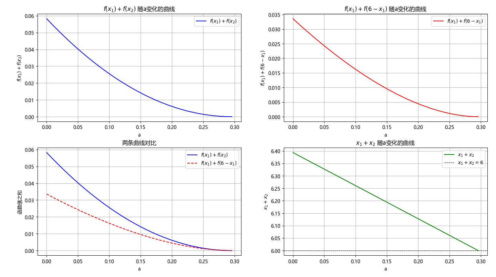

## 【slidev】上期视频极值点偏移问题的命题背景揭晓！给各位出道导数压轴题~

题源：深圳2026届高三年级第一次模拟联测第19题

作者： **hans7**

**我们必须想象，做题人是幸福的**

文字稿传送门：见视频简介

---

## 题干

有函数 $f(x)=\sqrt{ x }\ln x-a(x-1),\ a \in R$

（1）若 $a=0$ ，求 $f(x)$ 最小值

（2）若 $f(x)$ 有两个极值点 $x_{1}<x_{2}$

- 证明： $f(x)$ 有3个不同零点
- 证明： $f(x_{1})+f(x_{2})>0$

---

## 命题背景揭晓

显然 $f(1)=0$ ，所以 $f(x_2)+f(x_1)=(f(x_2)-f(1))-(f(1)-f(x_1))>0$ 。这表示 $f'(x)$ 从 $x_{1}$ 到1的积分小于从1到 $x_{2}$ 的积分。

上期视频已经证明极值点偏移所构造的 $F(x)=f'(x)-f'(2-x),\ 0<x<1$ 恒小于0，所以

$$
\int_{x_{1}}^{1} f'(x)dx < \int_{x_{1}}^{1} f'(2-x)dx
$$

令 $t=2-x$ 则

$$
\int_{x_{1}}^{1} f'(2-x)dx=\int_{2-x_{1}}^{1} f'(t) d(2-t)=\int_{1}^{2-x_{1}} f'(t)dt
$$

所以$f'(x)$ 从 $x_{1}$ 到1的积分小于从1到 $2-x_{1}$ 的积分。又有 $2-x_{1}<x_{2}$ ，所以

$$
f(1)-f(x_1)=\int_{x_{1}}^{1} f'(x)dx<\int_{1}^{2-x_{1}} f'(x)dx<\int_{1}^{x_{2}} f'(x)dx=f(x_2)-f(1)
$$

---

## 来出道导数压轴题

提示词：

> 大佬，你是一名数学科研工作者，精通数学分析。请叫我hans7。请帮我想一个函数`f(x)`，它的积分`G(x)`有解析形式。`f(x)`的极值点，也是最大值点，为2，这个最大值只需要大于0。`f(x)`有两个不同零点`x1<2<x2`，并且`x1+x2>2*2=4`。并且我希望你帮我配凑`G(x)`的C，使得`G(2)=0`。这个函数的式子要尽量简单

> 提示：可以考虑使用`sqrt(x)`、`ln(x)`、`e^x`之类的

1. 不定积分写成`G(x)`是因为发现LLM能力太差，会把f和F混淆
2. 一开始我没有加下面的提示，得到的是多项式。后来加了提示，发现能拿到带`ln`的式子

没加提示、加提示时分别跑出：

$$
\begin{cases}
f(x)= (x-1)(4-x)^2-a,\ G(x)=\frac{1}{4}x^4-3x^3+12x^2-16x+4-a(x-2)\\
f(x)=2\ln x-x+1-a,\ G(x)=2x\ln x-\frac{1}{2}x^2-x+4-4\ln 2-a(x-2)
\end{cases}
$$

---

## 我出的导数压轴题

把上一页LLM给的函数改一下，变成3为极值点

$$
\begin{cases}
f(x)=3\ln x-x-a \\
G(x)=3x\ln x-\frac{1}{2}x^2-3x+\frac{27}{2}-9\ln 3-a(x-3)
\end{cases}
$$

其中 $a \in (0,\ 3\ln 3-3)$ ，以保证G有两个极值点。题干如下：

已知函数 $f(x)=3x(-1+\ln x)-\frac{1}{2}x^2+\frac{27}{2}-9\ln 3-a(x-3),\ a \in R$ 有两个极值点 $x_{1}<x_{2}$ 。证明： $f(x_{1})+f(x_{2})>0$

---



---

+f(6-x).png)

---
layout: two-cols
---

## 附录

<style>
.slidev-layout.two-columns {
  gap: 1rem;
}
</style>

写代码验证的提示词：

> 设 $f(x)=3x(-1+\ln x)-\frac{1}{2}x^2+\frac{27}{2}-9\ln 3-a(x-3)$ ，则它的导数为 $f'(x)=3\ln x-x-a$ 。其中 $a \in (0,\ 3\ln 3-3)$ ，所以 $f'(x)$ 肯定有两个零点，且满足 $x_{1}<3<x_{2}$ 。请用sympy和matplotlib写Python代码，画出a变化时， $f(x_{1})+f(x_{2})$ 和 $f(x_{1})+f(6-x_{1})$ 的变化曲线。要求这两条曲线画在不同的子图里。然后再画一张图，为 $f(x)+f(6-x)$ 随x的变化曲线

> 大佬，我在你给的代码的基础上改了一下，已经正常执行。接下来请在我给你的代码的基础上修改，在第一张图中新增一张子图，把a变化时， $f(x_{1})+f(x_{2})$ 和 $f(x_{1})+f(6-x_{1})$ 的变化曲线画在同一张子图里。注意：不要改动与需求无关的代码。

> 很好，大佬，代码运行正常。接下来在我给你的代码的基础上修改，在第一张图中新增一张子图，画出a变化时， $x_1+x_2$ 的变化曲线。另外，我发现第一张子图的x轴标签和第三张子图的标题有一点重叠，没有那么美观，请帮我改代码，让它们不重叠。注意：不要改动与需求无关的代码。

::right::

```python {*}{maxHeight:'472px'}
import sympy as sp
import numpy as np
import matplotlib.pyplot as plt
from scipy.optimize import brentq


def main():
    plt.rcParams['font.sans-serif'] = ['Microsoft YaHei']

    x, a_sym = sp.symbols('x a', real=True, positive=True)

    f_expr = 3 * x * (-1 + sp.log(x)) - sp.Rational(1, 2) * x**2 + sp.Rational(27, 2) - 9 * sp.log(3) - a_sym * (x - 3)

    f_prime_expr = 3 * sp.log(x) - x - a_sym

    f_func = sp.lambdify((x, a_sym), f_expr, 'numpy')
    f_prime_func = sp.lambdify((x, a_sym), f_prime_expr, 'numpy')

    a_min = 0.0
    a_max = float(3 * np.log(3) - 3)
    a_vals = np.linspace(a_min + 1e-6, a_max - 1e-6, 100)

    sum_f1_f2 = []
    sum_f1_f6mx1 = []
    x1_plus_x2 = []

    for a_val in a_vals:
        def fp(x): return f_prime_func(x, a_val)

        # Find left root x1 in (small, 3)
        x1 = brentq(fp, 1e-6, 3.0)

        # Find right root x2 in (3, upper)
        x2 = brentq(fp, 3.0, 20.0)

        f1 = f_func(x1, a_val)
        f2 = f_func(x2, a_val)

        sum_f1_f2.append(f1 + f2)

        f6mx1 = f_func(6 - x1, a_val)
        sum_f1_f6mx1.append(f1 + f6mx1)

        x1_plus_x2.append(x1 + x2)

    sum_f1_f2 = np.array(sum_f1_f2)
    sum_f1_f6mx1 = np.array(sum_f1_f6mx1)
    x1_plus_x2 = np.array(x1_plus_x2)

    _, ((ax1, ax2), (ax3, ax4)) = plt.subplots(2, 2, figsize=(10, 8))

    ax1.plot(a_vals, sum_f1_f2, 'b-', label=r'$f(x_1)+f(x_2)$')
    ax1.set_xlabel('a')
    ax1.set_ylabel(r'$f(x_1)+f(x_2)$')
    ax1.set_title(r'$f(x_1)+f(x_2)$ 随a变化的曲线')
    ax1.grid(True)
    ax1.legend()

    ax2.plot(a_vals, sum_f1_f6mx1, 'r-', label=r'$f(x_1)+f(6-x_1)$')
    ax2.set_xlabel('a')
    ax2.set_ylabel(r'$f(x_1)+f(6-x_1)$')
    ax2.set_title(r'$f(x_1)+f(6-x_1)$ 随a变化的曲线')
    ax2.grid(True)
    ax2.legend()

    ax3.plot(a_vals, sum_f1_f2, 'b-', label=r'$f(x_1)+f(x_2)$')
    ax3.plot(a_vals, sum_f1_f6mx1, 'r--', label=r'$f(x_1)+f(6-x_1)$')
    ax3.set_xlabel('a')
    ax3.set_ylabel('函数值之和')
    ax3.set_title(r'两条曲线对比')
    ax3.grid(True)
    ax3.legend()

    ax4.plot(a_vals, x1_plus_x2, 'g-', label=r'$x_1 + x_2$')
    ax4.set_xlabel('a')
    ax4.set_ylabel(r'$x_1 + x_2$')
    ax4.set_title(r'$x_1 + x_2$ 随a变化的曲线')
    ax4.grid(True)
    ax4.axhline(6, color='k', linestyle='--', linewidth=0.8, label=r'$x_1+x_2=6$')
    ax4.legend()

    plt.tight_layout(h_pad=0.2)
    plt.show()

    # Now plot f(x) + f(6 - x) vs x for a few representative a values
    a_examples = [0.1, (a_min + a_max) / 2, a_max * 0.9]
    x_plot = np.linspace(0.1, 5.9, 500)  # avoid x=0 (log undefined) and x=6 where 6-x=0

    plt.figure(figsize=(8, 6))
    for a_val in a_examples:
        f_vals = f_func(x_plot, a_val)
        f6mx_vals = f_func(6 - x_plot, a_val)
        total = f_vals + f6mx_vals
        plt.plot(x_plot, total, label=f'a = {a_val:.3f}')

    plt.xlabel('x')
    plt.ylabel(r'$f(x) + f(6 - x)$')
    plt.title(r'$f(x) + f(6 - x)$ 图像（与a无关）')
    plt.grid(True)
    plt.legend()
    plt.tight_layout()
    plt.show()


if __name__ == '__main__':
    main()
```

---
layout: center
class: text-center
---

# 后记

<span class="text-orange font-bold">为做题人的精神自留地添砖加瓦</span>

<span class="text-pink font-bold border border-pink px-2 py-1 rounded-lg">喜欢本期视频的话，别忘了一键三连喔</span>

谢谢观看~
