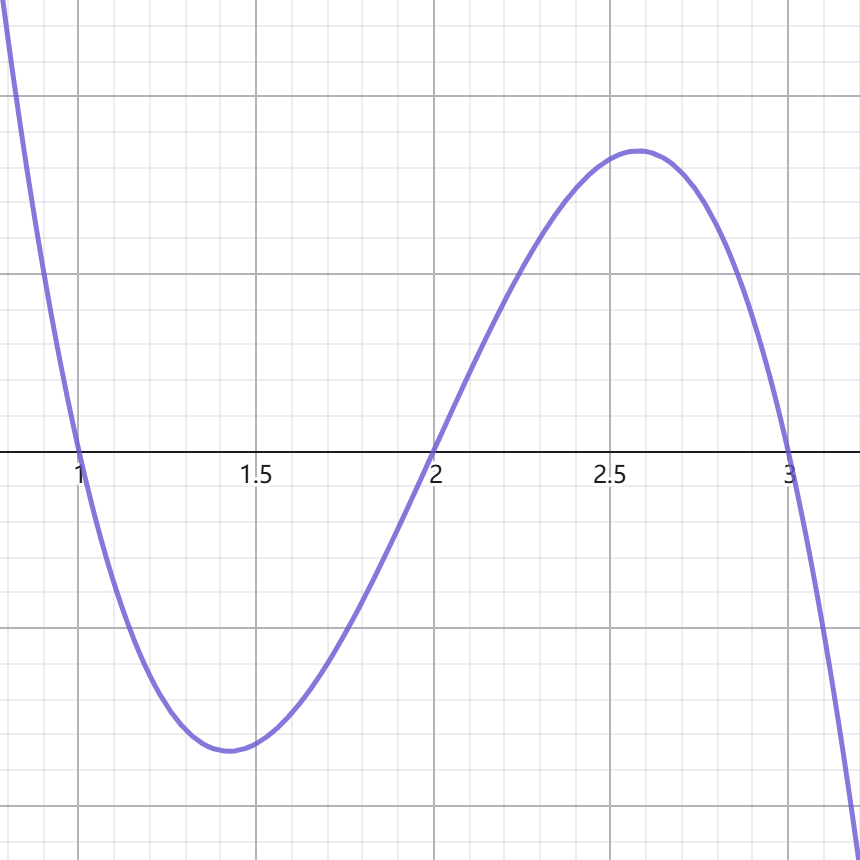

<SlidevPageRedirector />
<MovingWatermark />
<AutoSlide :timeList="[[13, 11.5], 21, 11.5, 43.5, 46, 49, 60, 21, 58]" />

## 深圳第一次模拟联测这道极值点偏移不简单！保姆级讲解，学渣也能听懂~

题源：深圳2026届高三年级第一次模拟联测第19题

作者： **hans7**

**我们必须想象，做题人是幸福的**

文字稿传送门：见视频简介

---

## 题干

有函数 $f(x)=\sqrt{ x }\ln x-a(x-1),\ a \in R$

（1）若 $a=0$ ，求 $f(x)$ 最小值

（2）若 $f(x)$ 有两个极值点 $x_{1}<x_{2}$

- 证明： $f(x)$ 有3个不同零点
- 证明： $f(x_{1})+f(x_{2})>0$

  <!-- 去掉 v-if 就没有控制台警告，但元素显示不符合预期。
  加上1个 v-if 并往前翻页就会有警告 [slidev] ClicksContext: Unexpected register after mounted ，但貌似无伤大雅。
  加上2个 v-if 前后翻页都会有报错。最终选择加上1个 v-if ，元素显示不太符合预期，但也没办法
  亲测通义千问和 kimi 的组件方案都不对 -->
  

    

      当一幢建筑物完成时，应该把脚手架拆除干净
    

    

      ——高斯
    

  

  
    保姆级讲解这道极值点偏移+放缩，学渣也能听懂~
  

---

## （1）求 $\sqrt{ x }\ln x$ 最小值

常规题。 $f'(x)=\frac{\ln x}{2\sqrt{ x }}+\frac{\sqrt{ x }}{x}$ 。这里需要通分。我们有两个选择：通分成x，通分成 $2\sqrt{ x }$ 。

选前者： $f'(x)=\frac{\sqrt{ x }\ln x+2\sqrt{ x }}{2x}=\frac{\sqrt{ x }(2+\ln x)}{2x}$

选后者： $f'(x)=\frac{2+\ln x}{2\sqrt{ x }}$

殊途同归，计算量都很小。分母恒正，所以 $(0, \frac{1}{e^2}]$ 上单减， $(\frac{1}{e^2},+\infty)$ 上单增。最小值 $f(\frac{1}{e^2})=-\frac{2}{e}$

---
layout: two-cols-header
---

## 2.1 $f(x)$ 有两个不同极值点，证明它有3个不同零点

::left::

起手式，求导： $f'(x)=\frac{2+\ln x}{2\sqrt{ x }}-a$ 。前面那坨有点棘手，我们继续求导：

$$
f''(x)=\frac{\frac{2\sqrt{ x }}{x}-\frac{2+\ln x}{\sqrt{ x }}}{4x}=\frac{-\ln x}{4x^{\frac{3}{2}}}
$$

这下明朗了。 $f'(x)$ 在 $(0,1]$ 单增， $(1,+\infty)$ 单减，最大值 $f'(1)=1-a$ 。但我们还需要研究0和 $+\infty$ 处的情况，才能刻画出 $f'(x)$ 。求极限：

$$
\lim_{ x \to 0 } \frac{2+\ln x}{2\sqrt{ x }}-a=\frac{-\infty}{0}-a=-\infty
$$

$$
\lim_{ x \to +\infty } \frac{2+\ln x}{2\sqrt{ x }}-a=\lim_{ x \to +\infty } \frac{\frac{1}{x}}{\frac{1}{\sqrt{ x }}}-a=\lim_{ x \to +\infty } \frac{1}{\sqrt{ x }}-a=-a
$$

后者用了次**洛必达法则**。

::right::

  

---
layout: two-cols-header
---

## 2.1续1

::left::

f有两个极值点即 $f'(x)$ 有两个零点，所以要满足

$$
\textcolor{orange}{
\boldsymbol{
\begin{cases}
1-a>0 \\
-a<0
\end{cases}
}
}
$$

解得 $0<a<1$ ，这里顺便得到 $x_{1}<1<x_{2}$ 。画 $f'(x)$ 函数图不难得到f图像类似于3次函数， $(0,x_{1}]$ 单减， $(x_{1},x_{2}]$ 单增， $(x_{2},+\infty)$ 单减。同理，我们还需要研究f在0和 $+\infty$ 处的情况： $\lim_{ x \to 0 } \sqrt{ x }\ln x-a(x-1)=(\lim_{ x \to 0 } \sqrt{ x }\ln x)+a=a$ 。这里仍然用到了**洛必达**：

$$
\lim_{ x \to 0 } \sqrt{ x }\ln x=\lim_{ x \to 0 } \frac{\ln x}{\frac{1}{\sqrt{ x }}}=\lim_{ x \to 0 } \frac{\frac{1}{x}}{-\frac{1}{2x^{3/2}}}=-\lim_{ x \to 0 } 2\sqrt{ x }=0
$$

注：网上流传的参考答案在这一步的分析是错的，错在没有仔细分析就强行口胡0处极限为正无穷

::right::

  

---
layout: two-cols-header
---

## 2.1续2

::left::

如果你学过**算法复杂度**，就很容易感觉到 $\sqrt{ x }\ln x$ 是比x**低阶的无穷大**，所以 $+\infty$ 处极限就是负无穷。但严格求这个 $\infty-\infty$ 型极限不那么简单。为了方便，我们求 $\frac{f(x)-a}{x}$ 的极限：

$$
\lim_{ x \to +\infty } \frac{f(x)-a}{x}=\left( \lim_{ x \to +\infty } \frac{\ln x}{\sqrt{ x }} \right)-a=-a
$$

括号里式子仍然需要洛必达。这表明 $+\infty$ 处f趋于 $-ax$ ，也就是负无穷。

综上， 0处极限为 $a>0$ 且 $f(x_{1})<0$ ，所以 $(0,x_{1})$ 有一个零点； $f(x_{2})>0$ 且 $+\infty$ 处极限为负无穷，所以 $(x_{2},+\infty)$ 有一个零点； $(x_{1},x_{2})$ 有一个显然的零点 $f(1)=0$ 。共3个，证毕

::right::

  

---

## 2.2 $f(x)$ 有两个不同极值点，证明 $f(x_{1})+f(x_{2})>0$

做法：极值点偏移+放缩。

### 发现极值点偏移模型，证 $x_{1}+x_{2}>2$

注意到 $f'(x)$ 里的 $\frac{2+\ln x}{2\sqrt{ x }}$ 先增后减，在**1处取得极大值**，而它和 $y=a$ 交于 $x_{1},\ x_{2}$ 。这就是一个标准的**极值点偏移**模型。上一问用洛必达算 $f'(x)$ 0和 $+\infty$ 处极限时我们看到， $\frac{2+\ln x}{2\sqrt{ x }}$ 0到1是从负无穷跑到1，1到正无穷却只从正数跑到0，右边下降缓得多，所以 $x_{2}$ 肯定是右偏， $x_{1}+x_{2}>2$ 。下面写下证明过程。

欲证 $x_{1}+x_{2}>2 \Rightarrow x_{2}>2-x_{1}$ ，由 $f'(x)$ 在大于1时单减，只需证 $f(x_{1})=f(x_{2})<f(2-x_{1})$ 。为此，构造 $F(x)=f'(x)-f'(2-x),\ 0<x<1$ ，则只需证 $0<x<1$ 时 $F(x)<0$ 恒成立。求导（注：不要写出具体式，先算好抽象函数再直接代入）：

$$
F'(x)=f''(x)+f''(2-x)=\frac{-\ln x}{4x^{\frac{3}{2}}}-\frac{\ln (2-x)}{4(2-x)^{\frac{3}{2}}}=\frac{4(2-x)^{\frac{3}{2}}\ln \frac{1}{x}-4x^{\frac{3}{2}}\ln (2-x)}{16x^{\frac{3}{2}}(2-x)^{\frac{3}{2}}}
$$

---

## 2.2 $f(x)$ 有两个不同极值点，证明 $f(x_{1})+f(x_{2})>0$

### 继续证 $x_{1}+x_{2}>2$

$$
\textcolor{orange}{
\boldsymbol{
F'(x)=\frac{(2-x)^{\frac{3}{2}}\ln \frac{1}{x}-x^{\frac{3}{2}}\ln (2-x)}{4x^{\frac{3}{2}}(2-x)^{\frac{3}{2}}},\ 0<x<1
}
}
$$

这里不需要再继续求导。注意到：

- $(2-x)^{1.5}>x^{1.5}>0$
- $\frac{1}{x}-(2-x)=x+\frac{1}{x}-2>0 \implies \ln \frac{1}{x}>\ln(2-x)>0$

所以 $0<x<1$ 总有 $F'(x)>0$ 。而 $F(1)=0$ ，所以 $0<x<1$ 总有 $F(x)<0$ ，证毕

---
layout: two-cols-header
---

## 2.2 $f(x)$ 有两个不同极值点，证明 $f(x_{1})+f(x_{2})>0$

### 放缩得答案

::left::

考试时看到难题中蕴含一个标准模型，先证了再说，说不定能用上。

我们现在拿到 $1<2-x_{1}<x_{2}$ ，而 $(x_{1},x_{2})$ 上f单增，所以不妨尝试**放缩** $f(x_{1})+f(x_{2})>f(x_{1})+f(2-x_{1})>0$ 。为此，我们构造 $G(x)=f(x)+f(2-x),\ 0<x<1$ ，则只需证 $0<x<1$ 时 $G(x)>0$ 恒成立 。求导：

$$
\textcolor{orange}{
\boldsymbol{
G'(x)=f'(x)-f'(2-x)=F(x)
}
}
$$

哈哈，我们发现了一个**巧合**。前面已经证出 $0<x<1$ 总有 $F(x)<0$ ，所以G在 $(0,1)$ 单减，又 $G(1)=0$ ，证毕

::right::

  

---
layout: center
class: text-center
---

# 后记

为做题人的精神自留地添砖加瓦

喜欢本期视频的话，别忘了一键三连喔

谢谢观看~
