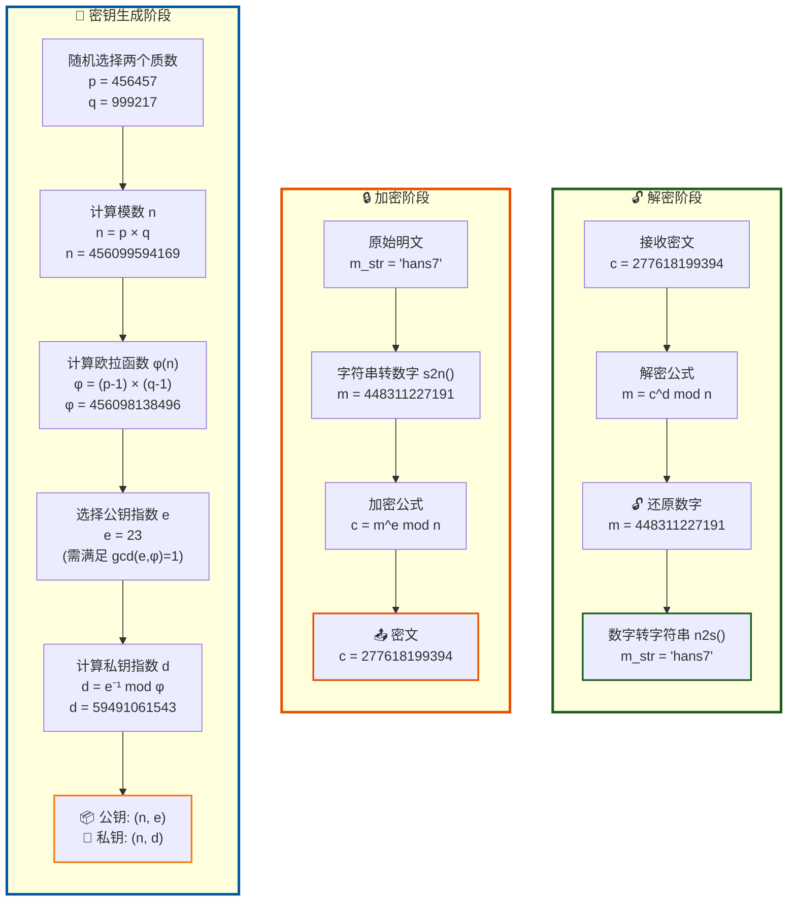
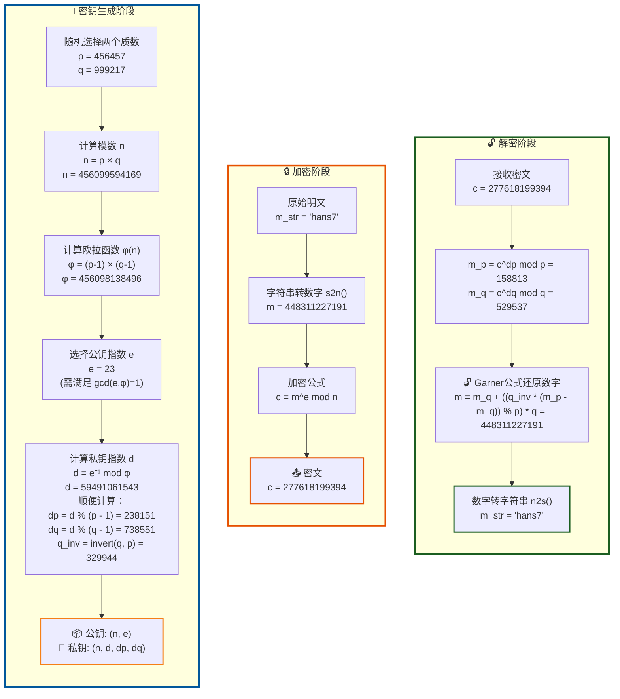

<SlidevPageRedirector />
<MovingWatermark />
<AutoSlide :timeList="[0, 42, 31.5, 14, 11, 38.5, 44.5, 51, 62, 32.5, 19, 36, 10.5, 56, 39.5, 12.5, 62.5, 7.5, 9.5]" />

留空

---

本期视频涉及的RSA题（来自BUUCTF Crypto、NewStar2025-Week1）：

<!-- 使用unocss无法使用box-shadow功能 https://github.com/feige996/unibest/issues/317 ，这里懒得去找解决方案了… -->
<div class="grid gap-4 md:grid-cols-3">
  <div
    v-for="(p, index) in [{ id: '1', title: 'buu rsarsa', intro: 'RSA模板题' }, { id: '2', title: 'buu RSAROLL', intro: 'RSA模板题，但滚动拼接flag'}, { id: '3', title: '初识RSA', intro: 'RSA模板题，附加对欧拉函数的简单理解。题源：NewStar2025-Week1，可在青岑CTF提交' }, { id: '4', title: 'buu RSA1', intro: 'RSA的中国剩余定理解密加速模板题'}, { id: '5', title: 'buu RSA3', intro: 'RSA3：RSA的共模攻击模板题' }]"
    :key="p.id"
    :class="[
      'block p-4 space-y-1.5 rounded-lg shadow',
      'bg-(--current-line)',
      'border border-[hsl(265,89%,78%,0.7)]',
      'transition-all duration-300',
      'hover:border-[hsl(265,89%,78%)] hover:shadow-xl hover:shadow-[hsl(265,89%,78%,0.2)] hover:-translate-y-1'
    ]"
  >
    <div class="text-2xl font-bold text-[hsl(265,89%,78%)]">
      {{ p.title }}
    </div>
    <div
      v-if="p.intro"
      class="text-(--foreground) text-sm"
    >
      {{ p.intro }}
    </div>
  </div>
</div>

<div class="h-30 flex justify-center items-center text-5xl text-orange">
突然发现，学RSA是入门数论的好办法~
</div>

<div class="flex justify-center items-center text-4xl text-orange">
学以致用，真正掌握数论知识~
</div>

---

## 前置芝士（简单眼熟即可，不必懂来龙去脉，后面会反复用到）

For more info，可查询CTF Wiki或OI Wiki

1. **欧拉函数**：小于等于n，和n互质的正整数的个数，记为 $\phi(n)$ 。由定义不难得到： $\phi(1)=1,\ \phi(p)=p-1,\ \phi(p^k)=p^k-p^{k-1}$ 。
2. **积性函数**：**欧拉函数**是积性函数，即对于任意互质的 $a,b$ ，都有 $\phi(ab)=\phi(a)\phi(b)$
3. 由 $\phi(p^k)=p^k-p^{k-1}$ 、积性函数的性质和**唯一分解定理**不难推出欧拉函数的表达式：设 $n=\prod_{i=1}^s p_{i}^{a_{i}}$ ，则 $\phi(n)=\prod_{i=1}^s (p_{i}^{a_{i}}-p_{i}^{a_{i}-1})$ 。举例： $\phi(300)=\phi(2^2*3*5^2)=(2^2-2^1)(3-1)(5^2-5^1)=80$
4. **欧拉定理**：如果整数a和模数m互质，那么 $a^{\phi(m)} \equiv 1\ (mod\ m)$ 。特殊地，m是素数p时得**费马小定理** $a^{p-1} \equiv 1\ (mod\ p)$
5. **裴蜀定理**：设 $a,b$ 是不全为零的整数（至少有一个不为0）。那么对于任意整数 $x,y$ ，都满足 $gcd(a,b)\ |\ ax+by$ ；而且，存在整数 $x,y$ ，使得 $ax+by=gcd(a,b)$ 成立
6. **乘法逆元**：由**裴蜀定理**不难推出：对于整数a和模数m，若 $gcd(a,m)=1$ ，则存在整数x使得 $ax \equiv 1 \ (mod\ m)$ ，这里的x称为a的乘法逆元。逆元有**对称性**，所以我们说x和a互为逆元

---

## 扩展欧几里得算法（同样简单眼熟即可）

解不定方程 **$ax+by=gcd(a,b)$** 的算法：**扩展欧几里得算法**。对**辗转相除法**进行升级得来。

**辗转相除法**的代码：

```python
def gcd(a, b):
    return a if b == 0 else gcd(b, a % b)
```

**扩展欧几里得算法**的代码：

```python
def egcd(a, b):
    if b == 0:
        return a, 0, a
    x, y, g = egcd(b, a % b)
    return y, x - (a // b) * y, g
```

注：不需要了解算法细节（~~除非你打acm~~），在Python里也不需要手打

1. Python内置math包自带求最大公约数的函数`from math import gcd`
2. gmpy2有**扩展欧几里得算法**的函数`from gmpy2 import gcdext`

---

## 中国剩余定理（CRT）简介（同样简单眼熟即可）

[裴蜀定理、中国剩余定理科普传送门](https://www.cnblogs.com/1024th/p/14349347.html)。简单来说，它告诉我们怎么解**线性同余方程组**

$$
\begin{cases}
x \equiv a_{1}\ (mod\ m_{1}) \\
x \equiv a_{2}\ (mod\ m_{2}) \\
\dots \\
x \equiv a_{k}\ (mod\ m_{k})
\end{cases}
$$

其中， $m_{1},m_{2},\dots,m_{k}$ 两两互素，即 $gcd(m_{i},m_{j})=1,\ \ i \neq j$

我们设总模数 $M=m_{1}m_{2} \dots m_{k},\ M_{i}=\frac{M}{m_{i}}$ 。于是 $gcd(m_{i},M_{i})=1$ 。**裴蜀定理**告诉我们，这时 $M_{i}$ 存在唯一逆元 $y_{i}$ 使得 $M_{i}y_{i}\equiv1\ (mod\ m_{i})$ 。那么 $a_{i}M_{i}y_{i}$ 就满足了第i条方程。把它们加起来

$$
x=(\sum_{i=1}^{k} a_{i}M_{i}y_{i})\ mod\ M
$$

就满足所有方程啦~

---

## Python代码运行环境配置

我使用的Python版本：3.10.2。要安装的包：

```powershell
pip install pycryptodome
pip install gmpy2
pip install libnum
```

检验是否安装成功：

```python
from Crypto.Util.number import bytes_to_long
from gmpy2 import invert, powmod, gcdext
from libnum import n2s, s2n
```

1. `pycryptodome`这里只需要用到`bytes_to_long`函数，把byte string转为长整型
2. `gmpy2`（主要用到的包）提供了一些数论的函数，比如`invert(a,m)`求a在模m意义下的**乘法逆元**，`powmod(a,b,m)`求`a ** b % m`，`g,x,y = gcdext(a,b)`求不定方程 $ax+by=gcd(a,b)$ 的根
3. `libnum`只用到：`n2s`函数，数字转字符串；`s2n`函数，字符串转数字

---

## RSA加密算法介绍

RSA 加密算法是一种**非对称加密算法**（有**公钥**和**私钥**）。在公开密钥加密和电子商业中， RSA 被广泛使用

RSA 加密算法的可靠性由极大整数**因数分解**的难度决定。如果以后有人找到快速**因数分解**的算法，那么用 RSA 加密的信息的可靠性就会极度下降。但找到这样的算法的可能性是非常小的。如今，只有短的 RSA 密钥才可能被强力方式解破。到 2017 年为止，还没有任何可靠的攻击 RSA 算法的方式

## 基本原理

### 公钥与私钥的产生

1. 随机选择两个不同的**大质数** p 和 q，计算 $N=pq$
2. 根据**欧拉函数**，求得 $\phi(N)=\phi(p)\phi(q)=(p−1)(q−1)$
3. 选择一个小于 φ(N) 的整数 e，使 e 和 φ(N) 互质。并求得 e 关于 φ(N) 的模反元素，命名为 d，有 $ed \equiv 1\ (mod\ \phi(N))$
4. 将 p 和 q 的记录销毁

此时，`(N,e)`是公钥（可以公开的），`(N,d)`是私钥（不能公开的）

---
layout: two-cols
---



::right::

#### 消息加密

1. 将消息以一个双方约定好的格式转化为一个小于 N 的整数 m（后面会证明m不必和N互质）。如果消息太长，可以将消息分为几段，这就是所谓的**块加密**
2. 对于每一段，用公钥e加密： $m^e \equiv c\ (mod\ N)$

#### 消息解密

用私钥d解密：

$$
c^d \equiv m\ (mod\ N)
$$

回顾d的定义：e在模 $\phi(N)$ 意义下的逆元，即

$$
ed \equiv 1\ (mod\ \phi(N))
$$

#### 思考

1. 为什么公钥e可以公开，但私钥d不能公开？
2. 为什么说RSA的可靠性主要依赖极大整数**因数分解**的难度？

---

## 为什么RSA能完成加密和解密过程

只需证： $m^{ed} \equiv m\ (mod\ N)$ ，其中 $N=pq,\ ed \equiv 1\ (mod\ \phi(N)),\ gcd(e,\phi(N))=1$ 。不妨设 $ed = k\phi(N)+1$

### 1. $gcd(m,N)=1$

由**欧拉定理**， $m^{\phi(N)} \equiv 1\ (mod\ N)$ ，又 $ed = k\phi(N)+1$ ，故原式成立

### 2. $gcd(m,N)>1$

这时m必然是p或q的倍数。不失一般性，假设 $m=xp,\ 1 \leq x \leq q-1$ 。由**费马小定理**： $m^{q-1} \equiv 1\ (mod\ q)$ 。又由 $\phi(N)=(p-1)(q-1)$ ，我们得到

$$
\textcolor{orange}{
\boldsymbol{
m^{k\phi(N)+1}=m*(m^{(q-1)})^{k(p-1)} \equiv m\ (mod\ q)
}
}
$$

不妨设 $m^{k\phi(N)+1} = m+u_{0}q$ 。因为 $m^{k\phi(N)+1}$ 是m的倍数，且m和q互质，所以 $u_{0}$ 是m的倍数，不妨设为 $m^{k\phi(N)+1} = m+umq$ 。把 $umq$ 里的m换成 $xp$ 得 **$m^{k\phi(N)+1} = m+ux(pq)=m+uxN$** 。证毕！

---

## buu rsarsa-RSA模板题

题意：给了RSA的`p, q, e, c`，让你解出明文`m`

思路： $p, q \rightarrow n = pq,\ phi(n)=(p-1)(q-1) \rightarrow d \rightarrow m = c^d\ mod\ n$

1. 可以用这题检验你对RSA加解密过程的核心公式是否已经理解
2. 检验`gmpy2`是否安装成功
3. `invert(a,m)`求a在模m意义下的逆元，`powmod(a,b,m)`求`a ** b % m`

```python
from gmpy2 import invert, powmod

p = 9648423029010515676590551740010426534945737639235739800643989352039852507298491399561035009163427050370107570733633350911691280297777160200625281665378483
q = 11874843837980297032092405848653656852760910154543380907650040190704283358909208578251063047732443992230647903887510065547947313543299303261986053486569407
e = 65537
c = 83208298995174604174773590298203639360540024871256126892889661345742403314929861939100492666605647316646576486526217457006376842280869728581726746401583705899941768214138742259689334840735633553053887641847651173776251820293087212885670180367406807406765923638973161375817392737747832762751690104423869019034

n = p * q
phi = (p - 1) * (q - 1)
d = invert(e, phi)
m = powmod(c, d, n)
print(m)
```

---

## buu RSAROLL-RSA模板题，但滚动拼接flag

题意：给n、e（都很小）和密文（int数组），求明文。

RSA模板题双倍经验！n很小，找一个质因数分解网站求出`p, q`，剩下的就是套模板了

```python
from gmpy2 import invert, powmod

n = 920139713
p = 18443
q = 49891
e = 19
phi = (p - 1) * (q - 1)
d = invert(e, phi)
c_list = []  # 很长，省略
fl = ''
for c in c_list:
    m = powmod(c, d, n)
    fl += chr(m)
print(fl)
```

---

## 初识RSA

题源：NewStar2025-Week1，可在青岑CTF提交。题目给了`[Cry]初识rsa.py`（略）

读代码：

1. 代码展示了RSA加密过程，目标是解出明文（`flag`变量）
2. 给了`key`变量的md5值`KEY`，需要据此求出`key`
3. 给了`P, n, c`。如果求出`key`，就能用`P, key`求出`p`

解题过程：

1. 根据提示“MD5 码怎么解呢？好像有在线工具”，找一个[在线网站](https://www.cmd5.com/default.aspx)就能得到`key`
2. `P = p ^ (bytes_to_long(key))`（异或符号），所以`p = P ^ (bytes_to_long(key))`
3. n和p已知，所以可以直接用gmpy2的`iroot`求出q：`q, _ = iroot(n // p // p // p, 2)`
4. p和q是素数， $e = 65537,\ n = p^3 * q^2,\ c = m^e\ mod\ n$ 。由**欧拉定理**，明文就是 $m = c^d\ mod\ n$ 。其中d为e在模 $\phi(n)$ 意义下的逆元，用gmpy2来求：`d = invert(e, phi)`
5. 根据**欧拉函数**的表达式得 $\phi(n) = p ^ 2 * (p - 1) * q * (q - 1)$

---

## 初识RSA（续）

```python
from Crypto.Util.number import bytes_to_long
from gmpy2 import invert, iroot, powmod
from libnum import n2s

e = 65537
P = 8950704257708450266553505566662195919814660677796969745141332884563215887576312397012443714881729945084204600427983533462340628158820681332200645787691506
n = 44446616188218819786207128669544260200786245231084315865332960254466674511396013452706960167237712984131574242297631824608996400521594802041774252109118569706894250996931000927100268277762882754652796291883967540656284636140320080424646971672065901724016868601110447608443973020392152580956168514740954659431174557221037876268055284535861917524270777789465109449562493757855709667594266126482042307573551713967456278514060120085808631486752297737122542989222157016105822237703651230721732928806660755347805734140734412060262304703945060273095463889784812104712104670060859740991896998661852639384506489736605859678660859641869193937584995837021541846286340552602342167842171089327681673432201518271389316638905030292484631032669474635442148203414558029464840768382970333
c = 42481263623445394280231262620086584153533063717448365833463226221868120488285951050193025217363839722803025158955005926008972866584222969940058732766011030882489151801438753030989861560817833544742490630377584951708209970467576914455924941590147893518967800282895563353672016111485919944929116082425633214088603366618022110688943219824625736102047862782981661923567377952054731667935736545461204871636455479900964960932386422126739648242748169170002728992333044486415920542098358305720024908051943748019208098026882781236570466259348897847759538822450491169806820787193008018522291685488876743242619977085369161240842263956004215038707275256809199564441801377497312252051117441861760886176100719291068180295195677144938101948329274751595514805340601788344134469750781845
key = b'crypto'
p = P ^ (bytes_to_long(key))
q, _ = iroot(n // p // p // p, 2)
phi = p * p * (p - 1) * q * (q - 1)
d = invert(e, phi)
m = powmod(c, d, n)
print(n2s(int(m)).decode('utf-8'))
```

注：

1. gmpy2的`iroot`可以开n次方根
2. `invert(a,m)`求a在模m意义下的逆元，`powmod(a,b,m)`求`a ** b % m`

---

## buu RSA1

题意：给你`p, q, dp, dq, c`，求明文m

背景知识：这里 $d_{p}=d\ mod\ (p-1),\ d_{q}=d\ mod\ (q-1)$ 。标准RSA的解密过程要计算 $c^d \equiv m\ (mod\ n)$ ，d的位数很大，所以这个过程很耗时。但如果在加密时顺便算出 $d_{p},\ d_{q}$ ，根据中国剩余定理的相关知识，我们就能加速解密过程。

目标：求 $m \equiv c^d\ (mod\ n)$ 。设m模p、q分别为 $m_{p},\ m_{q}$ ，则由**费马小定理**：

$$
\textcolor{orange}{
\boldsymbol{
\begin{cases}
m_{p} \equiv c^d \equiv c^{d\ mod\ (p-1)} \equiv c^{d_{p}}\ (mod\ p) \\
m_{q} \equiv c^d \equiv c^{d\ mod\ (q-1)} \equiv c^{d_{q}}\ (mod\ q)
\end{cases}
}
}
$$

p、q互素，所以我们只需要解下面的**线性同余方程组**就能拿到m：

$$
\begin{cases}
m \equiv m_{p}\ (mod\ p) \\
m \equiv m_{q}\ (mod\ q)
\end{cases}
$$

**中国剩余定理**能做，但有更巧妙的做法~

---

## buu RSA1-推导Garner公式

查OI Wiki查到**Garner算法**，说的是：若a（ $a<\prod_{i=1}^{k} p_{i}$ ）满足下面的线性同余方程组：

$$
\begin{cases}
a \equiv a_{1}\ (mod\ p_{1}) \\
\dots \\
a \equiv a_{k}\ (mod\ p_{k})
\end{cases}
$$

则可用下面的式子（称为a的**混合基数表示**）表示a： $a=x_{1}+x_{2}p_{1}+x_{3}p_{1}p_{2}+\dots+x_{k}p_{1}p_{2}\dots p_{k-1}$ 。举例：这里我们想要的是 $m=x_{1}+x_{2}p$

把m的表达式代入方程1得： $m_{p} \equiv x_{1}\ (mod\ p)$ 。把m的表达式代入方程2得：

$$
\textcolor{orange}{
\boldsymbol{
m_{q} \equiv x_{1}+x_{2}p\ (mod\ q) \implies (m_{q}-x_{1})p_{inv} \equiv x_{2}(p*p_{inv}) \equiv x_{2} \ (mod\ q)
}
}
$$

其中 $p_{inv}$ 表示p在模q意义下的逆元。于是 $m=m_{p}+(((m_{q}-m_{p})*p_{inv})\ mod\ q)*p$

注：如果方程1和2互换，则m变为 $m=x_{1}+x_{2}q$ ，最后求出的表达式相应变为 $m=m_{q}+(((m_{p}-m_{q})*q_{inv})\ mod\ p)*q$ （后面代码实际用的公式），其中 $q_{inv}$ 表示q在模p意义下的逆元

---
layout: two-cols
---



::right::

## buu RSA1-流程图和代码

```python
from gmpy2 import invert, powmod
from libnum import n2s

p = 8637633767257008567099653486541091171320491509433615447539162437911244175885667806398411790524083553445158113502227745206205327690939504032994699902053229
q = 12640674973996472769176047937170883420927050821480010581593137135372473880595613737337630629752577346147039284030082593490776630572584959954205336880228469
dp = 6500795702216834621109042351193261530650043841056252930930949663358625016881832840728066026150264693076109354874099841380454881716097778307268116910582929
dq = 783472263673553449019532580386470672380574033551303889137911760438881683674556098098256795673512201963002175438762767516968043599582527539160811120550041
c = 24722305403887382073567316467649080662631552905960229399079107995602154418176056335800638887527614164073530437657085079676157350205351945222989351316076486573599576041978339872265925062764318536089007310270278526159678937431903862892400747915525118983959970607934142974736675784325993445942031372107342103852

m_p = powmod(c, dp, p)
m_q = powmod(c, dq, q)
q_inv = invert(q, p)
# 用 Garner 公式合并
h = (q_inv * (m_p - m_q)) % p
m_dec_crt = m_q + h * q
print(f'解密出的数字：{m_dec_crt}')
print(f'解密出的字符串：{n2s(int(m_dec_crt)).decode("utf-8")}')
```

---

## buu RSA3-RSA的共模攻击模板

题意：假设两个用户加密同一条消息m，使用了不同的公钥`e1, e2`，但模数n相同且已知，得到密文`c1, c2`。求m（**共模攻击**模板题）

$$
\begin{cases}
c_{1} \equiv m^{e_{1}}\ (mod\ n) \\
c_{2} \equiv m^{e_{2}}\ (mod\ n)
\end{cases}
$$

我们考虑 $c_{1}^{x}*c_{2}^{y} \equiv m^{xe_{1}+ye_{2}}\ (mod\ n)$ ，如果 $xe_{1}+ye_{2}=1$ ，我们就达到了解密目的。由**裴蜀定理**，当且仅当 $gcd(e_{1},e_{2})=1$ ，可以解出这样的x和y。

写代码的注意点：

1. `gmpy2`提供了`gcdext`来解不定方程 $xe_{1}+ye_{2}=1$ ，不需要手打
2. $e_{1},e_{2}$ 都是正数，所以`x,y`里会有一个负数。先求 $c_{1}$ 或 $c_{2}$ 的逆元，再求逆元的正数次方即可
3. `powmod`拿到的是`gmpy2`的`mpz`类型，可以用`int()`转为Python整数
4. 用`libnum`的`n2s`把数字形式的明文转为字符串

---

## buu RSA3-代码

```python
from gmpy2 import invert, powmod, gcdext
from libnum import n2s

c1 = 22322035275663237041646893770451933509324701913484303338076210603542612758956262869640822486470121149424485571361007421293675516338822195280313794991136048140918842471219840263536338886250492682739436410013436651161720725855484866690084788721349555662019879081501113222996123305533009325964377798892703161521852805956811219563883312896330156298621674684353919547558127920925706842808914762199011054955816534977675267395009575347820387073483928425066536361482774892370969520740304287456555508933372782327506569010772537497541764311429052216291198932092617792645253901478910801592878203564861118912045464959832566051361
n = 22708078815885011462462049064339185898712439277226831073457888403129378547350292420267016551819052430779004755846649044001024141485283286483130702616057274698473611149508798869706347501931583117632710700787228016480127677393649929530416598686027354216422565934459015161927613607902831542857977859612596282353679327773303727004407262197231586324599181983572622404590354084541788062262164510140605868122410388090174420147752408554129789760902300898046273909007852818474030770699647647363015102118956737673941354217692696044969695308506436573142565573487583507037356944848039864382339216266670673567488871508925311154801
e1 = 11187289
c2 = 18702010045187015556548691642394982835669262147230212731309938675226458555210425972429418449273410535387985931036711854265623905066805665751803269106880746769003478900791099590239513925449748814075904017471585572848473556490565450062664706449128415834787961947266259789785962922238701134079720414228414066193071495304612341052987455615930023536823801499269773357186087452747500840640419365011554421183037505653461286732740983702740822671148045619497667184586123657285604061875653909567822328914065337797733444640351518775487649819978262363617265797982843179630888729407238496650987720428708217115257989007867331698397
e2 = 9647291


# 这里约定 cma 是 Common Modulus Attack 的缩写
def cma(n, e1, c1, e2, c2):
    _, s1, s2 = gcdext(e1, e2)
    if s1 < 0:
        s1 = -s1
        c1 = invert(c1, n)
    if s2 < 0:
        s2 = -s2
        c2 = invert(c2, n)
    return powmod(c1, s1, n) * powmod(c2, s2, n) % n


res = int(cma(n, e1, c1, e2, c2))
print(res)
print(n2s(res).decode('utf-8'))
```

---

## 附录1：自学RSA共模攻击和CRT加速解密的提示词

> 大佬，你是一名数学科研工作者，精通数论。我是高中生，请用通俗易懂的语言向我介绍rsa加密、解密的原理，以及共模攻击。记得给出buuctf上最基础的共模攻击的题目的python代码

> 大佬，请问给定p、q、dp、dq和c（密文）求解明文的算法是什么？可以给我详细介绍下吗

> 大佬，请写两段Python代码，演示标准的RSA的加密过程和用dp、dq加速的RSA加密过程。明文字符串m = 'hhh114514'，请你选一种简单的手段把它变成数字。p = ..., q = ..., e = 65537（注：选用buuctf题目给的数字就行）

效果：只能说，老师还是有存在的价值的…

---
layout: center
class: text-center
---

# 后记

<span class="text-orange font-bold">为做题人的精神自留地添砖加瓦</span>

<span class="text-pink font-bold border border-pink px-2 py-1 rounded-lg">喜欢本期视频的话，别忘了点赞、收藏、关注喔</span>

谢谢观看~
